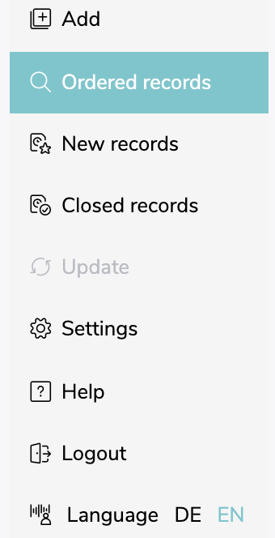
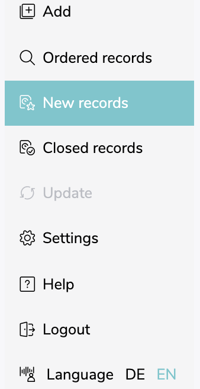
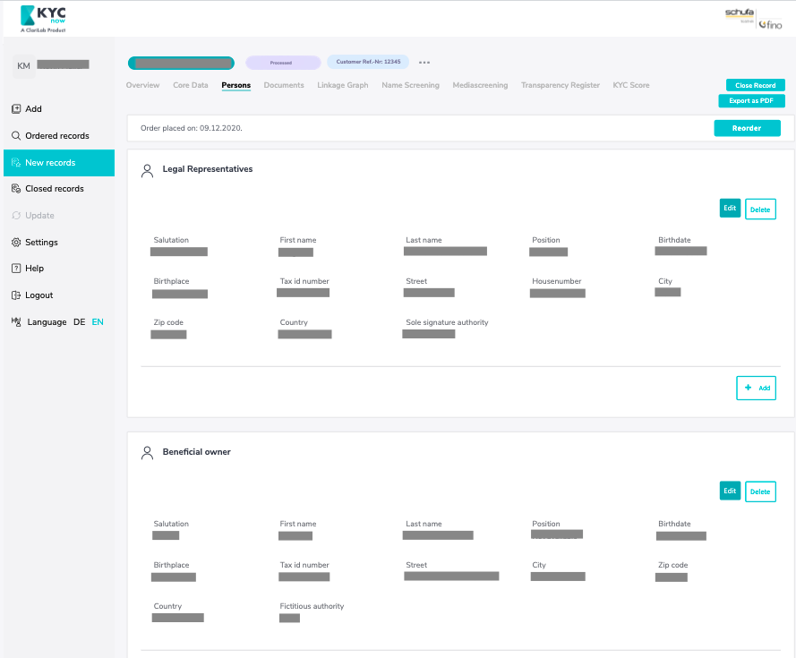
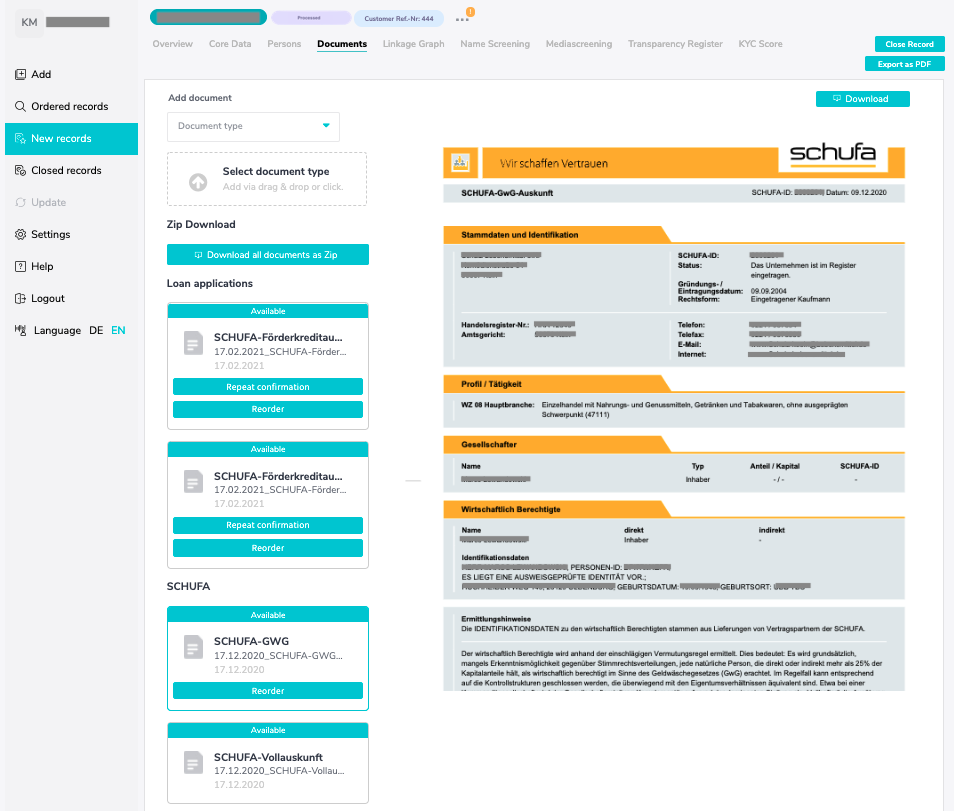
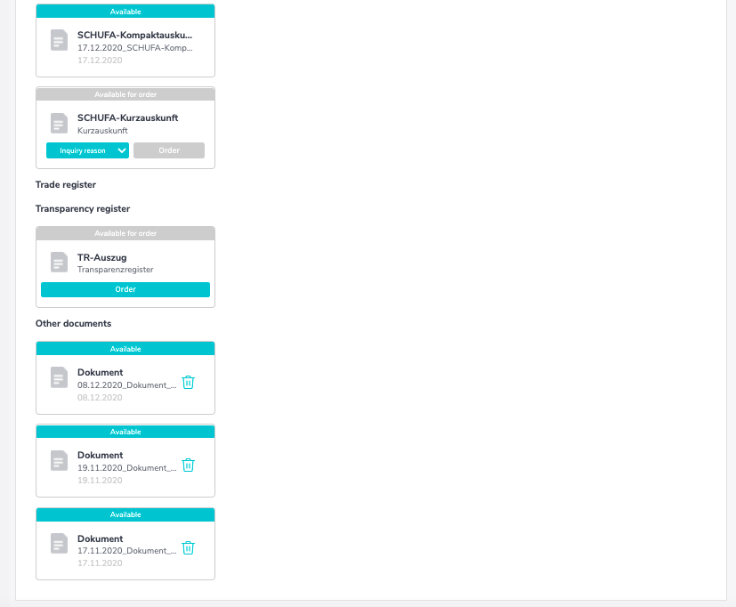
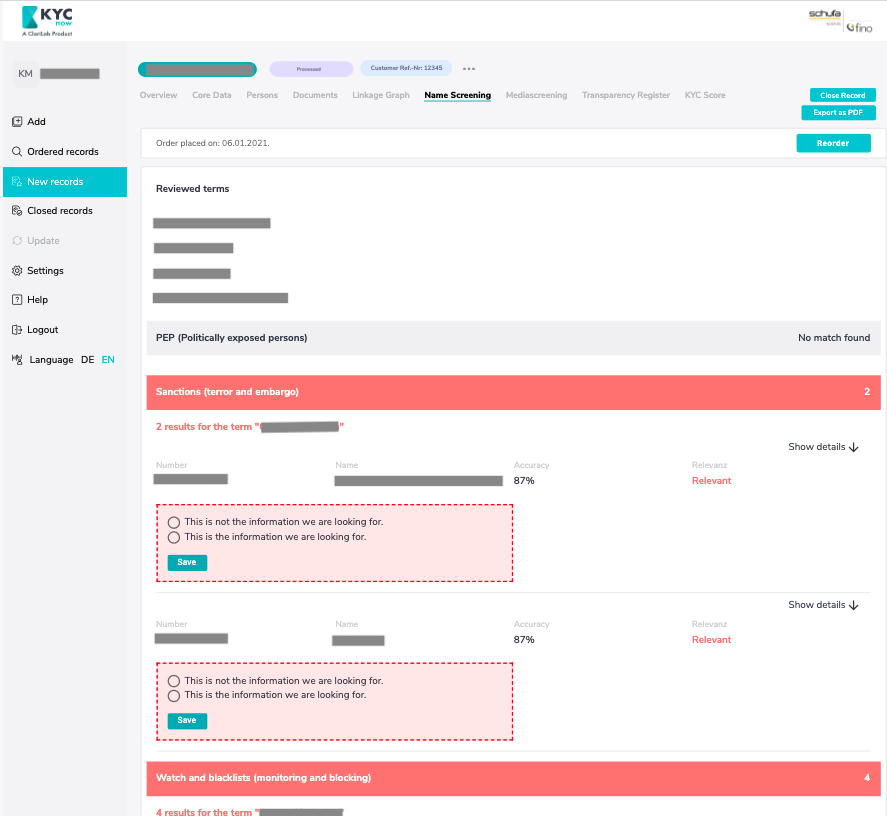
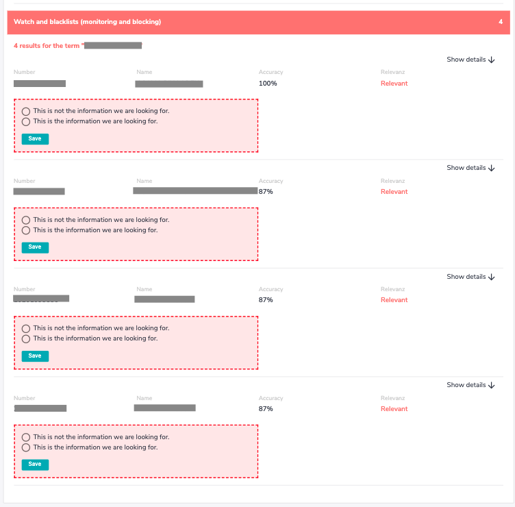
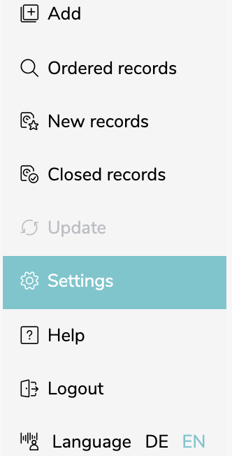

# Quickstart

---

**This page is in constant expansion!**

---

KYCnow enables you to automatically pull all KYC-relevant data / documents and makes them accessible to you via an interface or a web application. The data and documents are processed and evaluated by KYCnow in order to provide a recommendation on the money laundering risk of your (potential) customer.

KYCnow receives the data / documents via interfaces to Schufa, country-specific trade registers, the
Transparency Register and Dun&Bradstreet for companies with international branches. The data and documents are stored in KYCnow and can be viewed at any given time. In order to include a new company in the process, onboarding is available, which can be carried out by both you and your end customer.

## Add a case

In order to start a new KYC-Process you must first add a case.
By entering your customers name into the search bar, you can choose the correct customer from the results listed below

When you have found your customer, you can create a new record by klicking “Add”. From then on you will find the company under ”New Records”.

Per company one single record can be created. Once a company is already on record either under "New records" or under "Closed records", it is not possible to create an additional new record.

If at first attempt you can't find the company please use the advanced search as described below.

---

Should you have more specific information on the company you can enter the information into the „Advanced Search“ in order to find the company faster.

Possible Information is:

- Company Name
- Owner
- Industry sector code
- Street / Zip code / City
- Trade register number
- LEI-Number
- SCHUFA-ID
- Tax-ID

By clicking on „Add“ you can create a new record and will from then on be able to find the new record under „New records“.

If none of the provided searchresults fits to the company you are looking for, please read the following section "Research".

---

## Research

Should the company you're looking for not be found, you have the possibility to request a manual research for the company in question.
In order to do so, please click on "Start research". This Button appears at the bottom of the screen once you have started at least one advanced search.

To request a manual research all requested fields must be filled out. If possible please add proof of existence, e.g. a trade license in form of a PDF.

The manual processing of an inquiry takes a few workdays. It typically is processed much faster if you add proof of existence in form of a PDF.
Once you have requested a manual research, the company is listed in the "Ordered records"-tab for the duration of the research.

As soon as the manual research is completed you will receive a notice via Mail and the company will then be listed under "New records"

---

## New records

Under „New Records“ you will find all unfinished KYC-Processes. Apart from the name of the respective company you can also find the date on which the process was begun as well as its automatically calculated KYC Risk Rating.
(Insight into „All Cases“ is only possible as admin, if not every user in your company is authorized to do so.)

You can also look for a specific case using the search bar or by applying the filter provided under "Status".

By clicking on a record, you can find its respective overview.

---

### Overview of a KYCnow record

After selecting a specific record, you will first find an overview.
In this overview you will find all relevant information on the company, natural persons, Name Screening as well as the KYC-Score.
Using the tabs on the top, you can gather more specific information or update it.
By clicking the following icon on the top, you can add your own comments to the record.

---

### Core Data

The Core Data contains general Information on the company, its communication data as well as its activities
Should an update or an extension of the data be necessary, you can do so using either the editing button to update the information independently or by ordering a research. Such a research can be ordered at the bottom of the tab.

---

### Persons

Here you will find all necessary information on the legal representatives as well as the beneficial owners.
Here, too, you can request an update / extension of the data by clicking on request search below or edit the data yourself.

---

### Documents

Under the tab „Documents“ you can order and download the following types of documents:

- Based on SCHUFA:
  GwG-Vollauskunft, -Kompaktauskunft, -Kurzauskunft

- Based on the Trade register:
  Current Copy, chronological Copies, List of shareholders and shareholders’ agreement

- Extract of the Transparencyregister

You can also upload Trade register extracts and other documents you already have on file.

---

### Linkage Graph

The linkage graph visualises all natural and legal persons that are direct or indirect beneficiaries of the main corporates capital.
You can also use the linkage graph as a Visualisation of the determination of Ultimate Beneficial Owners 
It is possible to save the linkage graph as a PDF-file.
Please note that voting rights are not included.

---

### Name Screening

In the tab "Name Screening", you can see which terms were checked in the course of the namescreening and which hits were found.
The namescreening searches PEP-, sanction- (terror and embargo), watch- and blacklists for:

- The company name
- The names of the company's beneficial owners
- The legal representatives

If no hits are found, this implies that the search term does not exist in any of the available lists or that the displayed information has been deemed irrelevant.
Similar names are included in the results to minimize the risk of typing errors.
You can check the relevance of all information and thus also whether the information should be attached to the case or not.

---

### Media Screening

Media screening searches for (news-)articles, socialmedia profiles etc. about the company and its natural persons to be checked as part of the KYC-process

---

### Transparency Register

Here you can:

- Independently or automatically add beneficial owners
- Submit inconsistency reports
- Download transparency register extracts

[Here](transparencyregister.md) you can find a Guide on how to use the KYCnow-Module "Transparency Register"

---

### KYC Score

Under KCY Score, you will find the individual factors considered. The factors considered are:

- Industry affiliation
- Name screening
- Fraud score
- Countries in which the company is active (as well as all the companies listed in the linkage graph)
- Product score / risk
- Transaction score

---

## Closed records

Once you close a record it is moved from "New records" into "Closed records". There, the case is frozen in an audit-proof manner and saved.

Once the record is closed, no more changes can be made!

In this tab you can look into all closed records. As in the tab "New records", you can gain more specific insights into the record by clicking on it.

---

## Settings as administrator

As an administrator you can:

- Activate other users as administrators
- Add or remove other users
- Reset passwords

As an administrator, you can switch between all KYCnow records as well as your own.

Other users, if not given the permission, can only see those KYCnow records they created themselves.

---

## Settings for the transparency register

In this tab you must enter the access data to your transparency register account so that orders can be placed in the trancparency register directly via the platform.