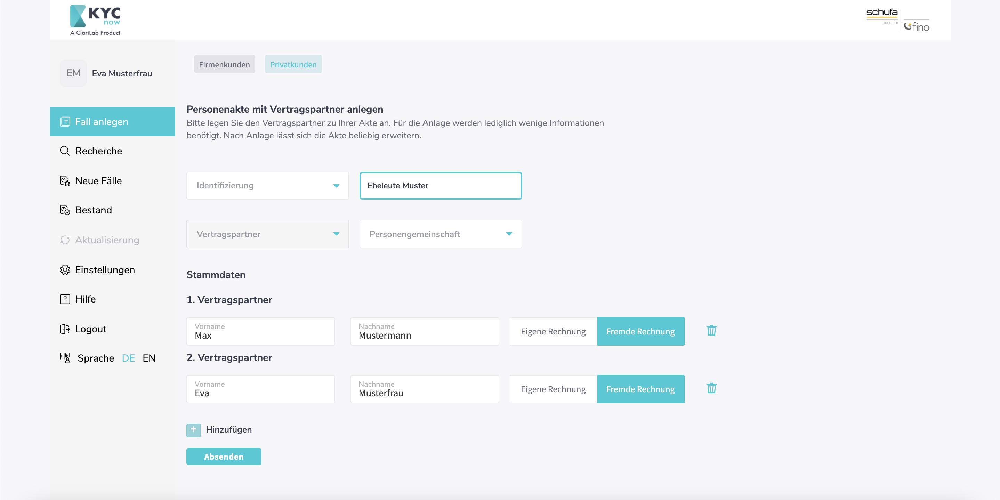
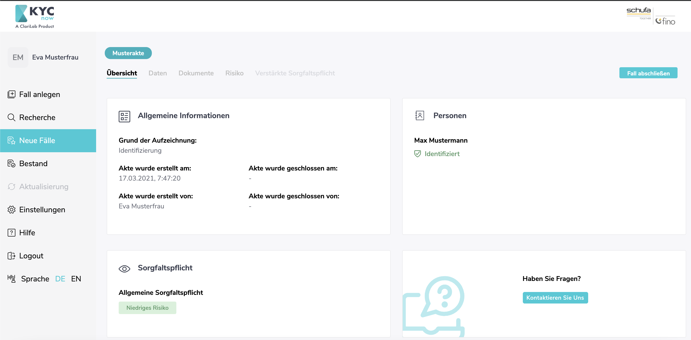
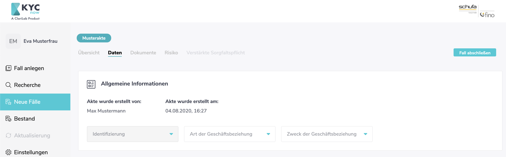
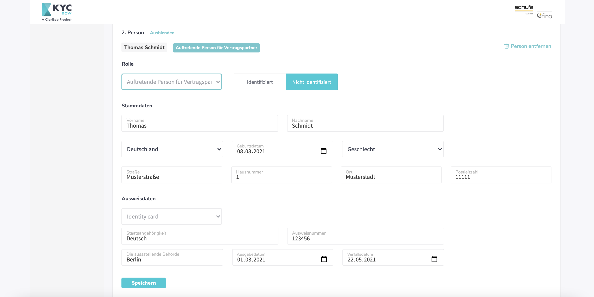
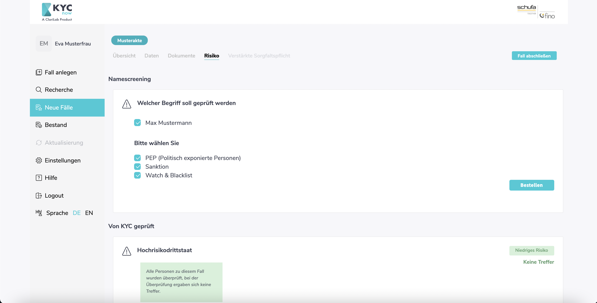

# KYCnow Privatpersonen Guide

---

**Diese Seite befindet sich in stetiger Erweiterung!**

---

KYCnow hilfe Ihnen dabei eine digitale KYC-Akte für eine Geschäftsbeziehung mit natürlichen Personen zu erstellen. Dafür müssen Sie in KYCnow den Bereich "Privatpersonen" ausgewählt haben. Der Bereich "Juristische Personen" ist für die KYC-Prüfung von Firmen als Geschäftspartner vorgesehen.

## Grundsätzliche Abfolge

Die Erstellung einer digitalen KYC-Akte für eine Geschäftsbeziehung mit natürlichen Personen hat stets folgenden Ablauf:

1. Beschaffung aller nötigen Daten und Dokumente
2. Risikoprüfung
3. Erfüllung verstärkter Sorgfaltspflichten im Falle eines hohen Risikos
4. Revisionssichere Ablage der Akte

Für jeden dieser Schritte sind Funktionalitäten in KYCnow vorgesehen. Als erstes ist dabei immer ein neuer KYC-Fall [anzulegen](## Retail Guide). Dies ist in der linken Seitenliste möglich. Alle angelegten Fälle sind in dem Bereich "Neue Fälle" vorzufinden. Ist ein Fall abgeschlossen, wandert er in den Bestand.

Durch das Klicken auf den Aktennamen unter neue Fälle oder Bestand, landet man in einer Akte selbst. Diese ist durch die oberen unter dem Aktenname zu sehenden Reiter in verschiedene Bereiche unterteilt. Ganz links ist eine Aktenübersicht zu sehen. Die Abfolge der Bearbeitung wandert nun von links nach rechts durch alle Reiter hindurch. Zuerst müssen alle Daten und Dokumente in den gleichnamigen Reitern gesammelt werden. Ist dies erfolgt, findet die Risikoermittlung im Reiter Risiko statt. Bei hohem Risiko, ist der Reiter verstärkte Sorgfaltspflicht abschließend zu befüllen.

Um maximale Flexibilität zu gewährleisten, gibt KYCnow hier keine starre Reihenfolge der Bearbeitung vor. Es ist möglich Daten zu ergänzen/ändern und erneut das Risiko zu ermitteln. Die grundsätzliche Abfolge stellt daher eine Empfehlung in der Nutzung dar, aber ist vorerst nicht zwangsläufig vorgegeben.

## KYCnow Privatpersonen Schritt für Schritt Anleitung

In diesen Abschnitt werden Ihnen alle Schritte von der Erstellung der Akte bis hin zu ihrer revisionssicheren Ablage aufgezeigt. Die Reihenfolge der Schritte entspricht dabei der Abfolge in KYCnow.

### Fall anlegen

Beginnend mit Ihrem neuen KYC Prozess, ist eine neue Akte anzulegen. Gehen Sie dafür in den Bereich "Fall anlegen" und stellen Sie sicher, dass Sie KYCnow auf "Privatkunden" eingestellt haben. Sie sollten nun den folgenden Screen sehen:

Geben Sie zuerst den Grund der Aufzeichnung an. Die können hier zwischen "Identifizierung", "Verdacht auf Geldwäsche oder Terrorimusfinanzierung" sowie "Zweifel an den Identitätsangaben" wählen. Für einen üblichen KYC Prozess ist "Identifizierung" auszuwählen. Daraufhin können Sie der Akte einen individuellen Namen zuweisen.

Sie legen eine Akte immer mit mindestens einem Vertragspartner an - daher ist dieses Feld fix vorgegeben. Daraufhin entscheiden Sie im Rahmen der Anlage, ob es sich um eine Einzelperson oder eine Personengemeinschaft an Vertragspartners handelt. Der folgende Screenshot beschreibt die Anlage einer Einzelperson:

Zur Anlage der Akte sind Vor- und Nachname der Person zwingend erforderlich. Alle weiteren Daten sind später zu ergänzen. Weiterhin ist anzugeben, ob die Person auf eigene oder fremde Rechnung handelt. 

Legen Sie die Akte als Personengemeinschaft an, können Sie mehrere Personen einer Vertragspartnergruppe hinzufügen. Dies kann beispielsweise bei einem Immobiliengeschäft mit Eherpartnern der Fall sein. Eine Gruppe kann beliebig groß sein. 

Achten Sie darauf, dass Personen, welchen eine Akte angelegt wurde, nicht mehr aus der Akte gelöscht werden können. Weitere Personen können allerdings immer hinzugefügt werden.

### Übersicht

Nach Anlage gelangen Sie in die Übersicht der Akte. Dort sind alle wichtigen Informationen der Akte komprimiert vorzufinden. Die weitere Bearbeitung startet im Reiter "Daten".

### Daten

Der Reiter Daten bietet die Möglichkeit relevante Daten zu allen an dem KYC-Prozess beteiligten Personen zu sammeln. Er beginnt mit allgemeinen Informationen zur Akte im oberen Bereich:

Daraufhin finden die Person(en) vor, mit welchen die Akzte angelegt wurde. Diese können in ihren Stammdaten ergänzt, aber nicht mehr vollständig gelöscht werden. Eine Akte besteht daher immer mindestens aus einer Person mit der Rolle "Vertragspartner".

Weitere Personen können mit der Schaltfläche "Person hinzufügen" am unteren Ende des Bereichs hinzugefügt werden. Diese Personen können die Rollen "Vertragspartner", "Auftretende Person für Vertragspartner" oder "Wirtschaftliche Berechtigte/r" zugeordnet werden. Weiterhin können zusätzlich aufgenommene Personen wieder gelöscht werden.

Bitte fügen Sie hier alle Personen hinzu, die in den entsprechenden Rollen an Ihrer Geschäftsanbahnung beteiligt sind.

### Dokumente

Der Reiter "Dokumente" ist das der Akte zugehörige Dokumenten-Archiv. Wählen Sie dort einen Dokumententyp aus und laden einen zugehöriges Dokument, wie beispielsweise Kopien von Personalausweisen hoch.

### Risiko

Haben Sie alle Daten und Dokumente für Ihre neue KYC-Akte gesammelt, können Sie das Risiko Ihrer Akte in dem Reiter Risiko ermitteln. KYCnow stellt dafür vier Risiko Hardfacts zu Prüfung.

1. Namescreening

Alle der Akte hinzugefügten Personen werden gegen über 1200 PEP-, Sanktions-, Watch- und Blacklisten geprüft. Drücken Sie dafür den Button "Bestellen". Etwaige Treffer werden Ihnen mit entsprechenden Details angezeigt.

2. Hochrisikodrittstaat

Alle **Wohnsitzländer** aller Personen, die im Reiter Personen hinzugefügt wurden, werden automatisch gegen eine hinterlegte Liste an Hochrisikodrittstaaten geprüft. 

Diese Liste beinhaltet folgende Staaten: 

3. Unternehmensinternes Risiko

Hier können Sie ein festgestelltes unternehmensinternes Risiko gemäß Ihrer Risikoanalyse eintragen. Stellen Sie ein unternehmensinternes Risik fest, können Sie dieses im Reiter verstärkte Sorgfaltspflichten konkreter beschreiben.

4. Hochrisikotransaktion

Hier können Sie vermerken, falls es sich bei der Transaktion im Rahmen Ihres KYC Prozess um eine komplexe, große, ungewöhnliche oder ohne offensichtlichen wirtschaftlichen bzw. rechtmäßigen Zweck handelt. Ist dies der Fall, können Sie die Transaktion im Reiter "Verstärkte Sorgfaltspflicht" konkreter beschreiben

### Verstärkte Sorgfaltspflicht

### Bestand und Export