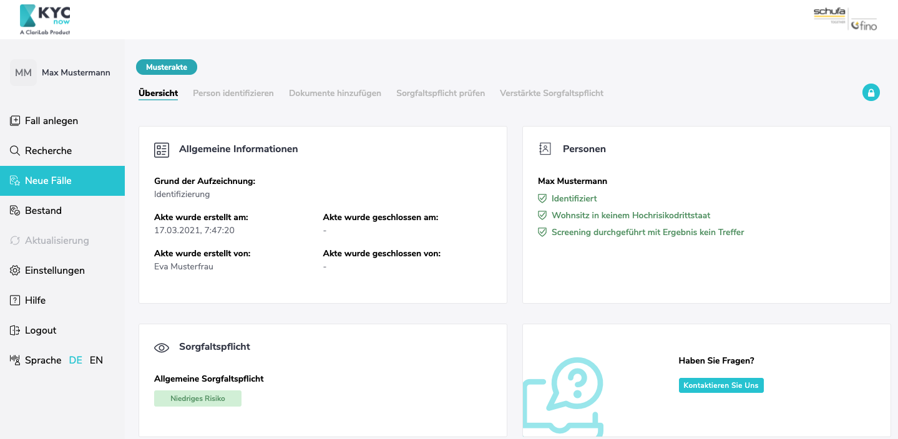
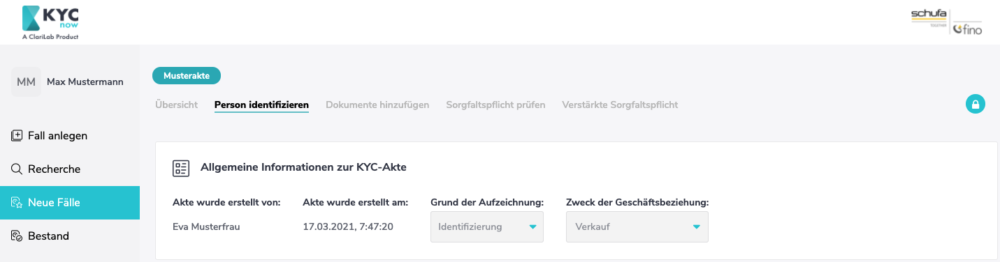
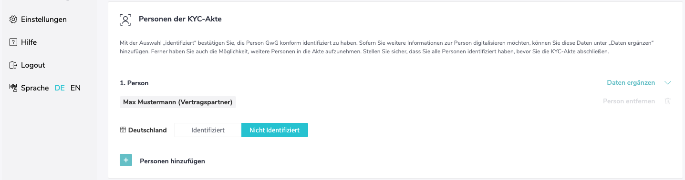
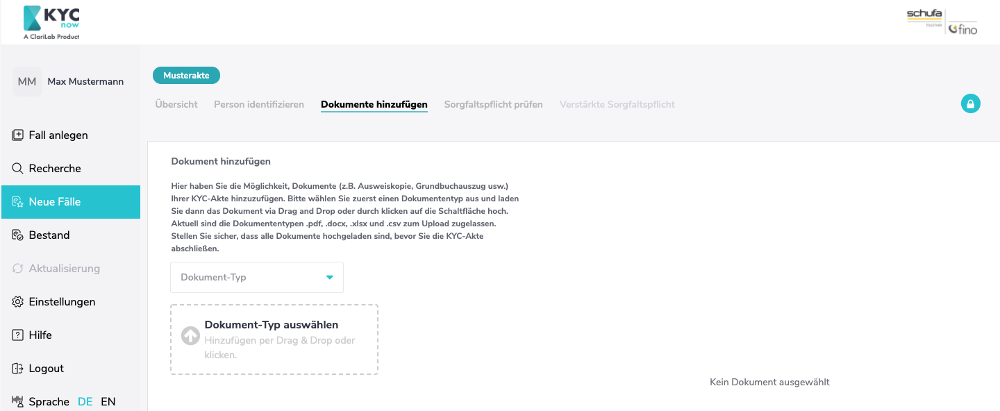

# KYCnow Guide - Privatpersonen

---

**Diese Seite befindet sich in stetiger Erweiterung!**

---

KYCnow hilft Ihnen dabei eine digitale KYC-Akte für eine Geschäftsbeziehung mit natürlichen Personen zu erstellen und unterstützt sie damit darin, Ihre geldwäscherechtlichen Pflichten einzuhalten.
Dafür müssen Sie in KYCnow den Bereich "Privatpersonen" ausgewählt haben. Der Bereich "Firmenkunden" ist für die KYC-Prüfung von Firmen als Geschäftspartner vorgesehen.

## Grundsätzliche Abfolge

Die Erstellung einer digitalen KYC-Akte für eine Geschäftsbeziehung mit natürlichen Personen hat stets folgenden Ablauf:

1. Akte anlegen
2. Beschaffung aller notwendigen Daten und Dokumente
3. Risikoprüfung
4. Erfüllung verstärkter Sorgfaltspflichten im Falle eines hohen Risikos
5. Revisionssichere Ablage der Akte

Für jeden dieser Schritte sind Funktionalitäten in KYCnow vorgesehen. Zu Beginn ist dabei immer ein neuer KYC-Fall anzulegen. Dies ist in der linken Seitenliste möglich. Alle angelegten Fälle sind in dem Bereich "Neue Fälle" vorzufinden. Ist ein Fall abgeschlossen, wandert er in den Bestand.

Durch das Klicken auf den Aktennamen unter neue Fälle oder Bestand, können Sie die jeweilige Akte einsehen.
Die Akte ist in verschiedene Bereiche unterteilt, welche Sie über die oben platzierten Reiter ansteuern können.
Die Reihenfolge der Reiter beginnt mit einer Aktenübersicht und ist dem logischen Ablauf der Prüfung entsprechend aufgebaut. Die Abfolge der Bearbeitung wandert also von links nach rechts durch alle Reiter hindurch.
Zuerst müssen alle Daten und Dokumente in den gleichnamigen Reitern gesammelt werden. Ist dies erfolgt, findet die Risikoermittlung im Reiter Risiko statt. Bei hohem Risiko, ist der Reiter verstärkte Sorgfaltspflicht abschließend zu befüllen. Sind schließlich alle Reiter durchlaufen, kann der Fall abgeschlossen werden.

Um maximale Flexibilität zu gewährleisten, gibt KYCnow hier keine starre Reihenfolge der Bearbeitung vor. Es ist also möglich Daten zu ergänzen/ändern und erneut das Risiko zu ermitteln. Die grundsätzliche Abfolge stellt daher eine Empfehlung in der Nutzung dar, aber ist vorerst nicht zwangsläufig vorgegeben.

## KYCnow Privatpersonen Schritt für Schritt Anleitung

In diesen Abschnitt werden Ihnen alle Schritte von der Erstellung der Akte bis hin zu ihrer revisionssicheren Ablage aufgezeigt. Die Reihenfolge der Schritte entspricht dabei der Abfolge in KYCnow.

### Fall anlegen

Zu Beginn Ihres neuen KYC-Prozesses, ist eine neue Akte anzulegen. Gehen Sie dafür in den Bereich "Fall anlegen" und stellen Sie sicher, dass Sie in der obigen Leiste "Privatkunden" eingestellt haben. Sie sollten nun den folgenden Screen sehen:

Weisen Sie der Akte zunächst einen individuellen Namen zu. Weiterhin müssen Sie zu Beginn den Zweck der Geschäftsbeziehung angeben, ob Sie einen Kaufvertrag vermitteln, oder einen Miet/Pachtvertrag mit einer Monatsmiete > 10.000€.
Schließlich wählen Sie noch aus, ob Ihr Vertragspartner eine Einzelperson oder eine Personengemeinschaft ist. Mit dieser Auswahl erscheinen weitere Felder in welchen Sie Daten zu Ihrem Vertragspartner(n) festhalten.
Die notwendigen Daten sind:

- Vorname
- Nachname
- Handeln auf Eigene Rechnung oder auf Fremde Rechnung
- Wohnsitz

Alle weiteren Daten sind später zu ergänzen.

Legen Sie die Akte als Personengemeinschaft an, können Sie mehrere Personen einer Vertragspartnergruppe hinzufügen. Dies kann beispielsweise bei einem Immobiliengeschäft mit Eherpartnern der Fall sein. Eine Gruppe kann beliebig groß sein und über den Button "Hinzufügen" erweitert, bzw. mit dem Papierkorb-Button verringert werden.

**Achten Sie darauf, dass diejenigen Personen, zu denen eine Akte angelegt wurde, nicht mehr aus der Akte gelöscht werden können. Auch der Zweck der Geschäftsbeziehung kann danach nichtmehr geändert werden. Weitere Personen können allerdings immer hinzugefügt werden.**

Sobald Sie auf "Akte anlegen" clicken, wandert die Akte in den Bereich "Neue Fälle" und Sie werden automatisch zu dem nächsten notwendigen Schritt, der Identifizierung der Person(en), weitergeleitet.

### Übersicht

Hier sind alle wichtigen Informationen der Akte komprimiert vorzufinden. Sie können hier auch jederzeit den Stand der Bearbeitung einsehen, also bspw. ob bereits alle Personen identifiziert wurden oder ob die Höhe der Sorgfaltspflicht bereits ermittelt wurde. Die weitere Bearbeitung startet im Reiter "Person identifizieren".

### Person identifizieren

Der Reiter Daten bietet die Möglichkeit relevante Daten zu allen an dem KYC-Prozess beteiligten Personen zu sammeln. Er beginnt mit unveränderlichen allgemeinen Informationen zur Akte, nämlich wer diese erstellt hat, dem Zeitpunkt wann die Akte erstellt wurde sowie dem Grund der Aufzeichnung (hier ist als Grund die "Identifizierung" vorausgewählt) und dem Zweck der Geschäftsbeziehung.

Darunter finden Sie die Person(en) vor, mit welchen die Akte angelegt wurde. Diese können in ihren Stammdaten ergänzt, aber nicht mehr vollständig gelöscht werden. Eine Akte besteht daher immer mindestens aus einer Person mit der Rolle "Vertragspartner".

Wenn Sie auf "Daten ergänzen" klicken, werden weitere Felder eingeblendet in denen Sie die zur Identifizierung notwendigen Daten festhalten können.

Weitere Personen können mit der Schaltfläche "Person hinzufügen" am unteren Ende des Bereichs hinzugefügt werden.
Wenn Sie einer Geschäftsbeziehung mit einer einzelnen Person eine weitere Person hinzufügen, kann der hinzugefügten Person eine der folgenden Rollen zugeteilt werden:

- Vertragspartner,
- Auftretende Person für Vertragspartner oder
- Wirtschaftlich Berechtigte/r

Im Falle einer Geschäftsbeziehung mit einer Personengemeinschaft, können Sie der Personengemeinschaft weitere Personen hinzufügen, diesen wird automatisch eine Rolle als Vertragspartner zugeteilt.
Sie können unter "Personen der KYC-Akte" außerdem auch Personen aufnehmen, welche außerhalb der Personengemeinschaft stehen. Hier können Sie den Personen wiederum eine der folgenden Rollen zuteilen:

- Vertragspartner,
- Auftretende Person für Vertragspartner oder
- Wirtschaftlich Berechtigte/r

**Zusätzlich aufgenommene Personen können wieder gelöscht werden.**

Bitte fügen Sie hier alle Personen hinzu, die in den entsprechenden Rollen an Ihrer Geschäftsanbahnung beteiligt sind.

Wenn Sie eine Person zu Ihrer Zufriedenheit identifiziert und alle entsprechenden Felder ausgefüllt haben, markieren Sie die Person bitte als "Identifiziert". Unter dem Reiter "Übersicht" können Sie jederzeit schnell erkennen, wen Sie bereits identifiziert haben und wen nicht.
Solange eine Akte noch nicht abgeschlossen ist, können Sie weiterhin Änderungen vornehmen.

### Dokumente hinzufügen

Der Reiter "Dokumente" ist das der Akte zugehörige Dokumenten-Archiv. Wählen Sie dort einen Dokumententyp aus und laden das zugehörige Dokument, wie beispielsweise Kopien von Personalausweisen hoch.

Sie können unter folgenden Typen Dokumente hochladen:

- Identifikationsdokumente
- Bonitätsdokumente
- Weitere Dokumente

### Sorgfaltspflicht prüfen

Haben Sie alle Daten und Dokumente für Ihre neue KYC-Akte gesammelt, können Sie das Geldwäscherisiko der Akte unter dem Reiter "Sorgfaltspflicht prüfen" an Hand verschiedener Risikofaktoren ermitteln. Aus dem ermittelten Risiko resultiert außerdem die aufzubringende Sorgfaltspflicht.

Haben Sie eine Akte neu angelegt steht hier zunächst "Nicht ermittelt". Um das Risiko zu ermitteln, müssen alle Risikofaktoren geprüft werden.
Erst wenn alle Risikofakturen geprüft wurden, lässt sich das Geldwäscherisiko einer Akte ermitteln und die Akte schließen.

1. Namescreening

Alle der Akte hinzugefügten Personen werden gegen über 1200 PEP-, Sanktions-, Watch- und Blacklisten geprüft. Drücken Sie dafür den Button "Screening starten". Etwaige Treffer werden Ihnen mit entsprechenden Details angezeigt.
Es obliegt Ihnen festzustellen, ob (einer) der Treffer relevant ist oder nicht.

Die Ergebnisse des Namescreenings werden entsprechend der Listen, für die ein Treffer gefunden wurde, unterteilt.
Die Listentypen sind:

- PEP-Listen (Politisch exponierte Personen)
- Sanktions- / Embargolisten
- Watch- / Blacklists

Es kann so beispielsweise vorkommen, dass sowohl ein Treffer in Sanktions- / Embargolisten gefunden wird, als auch in Watch- / Blacklists.

Wenn Sie im Verlauf der KYC-Prüfung neue Personen der Akte hinzufügen, muss das Screening nochmals durchgeführt werden.

2. Hochrisikodrittstaat

Alle **Wohnsitzländer** aller Personen, die im Reiter Personen hinzugefügt wurden, werden automatisch gegen eine hinterlegte Liste an Hochrisikodrittstaaten geprüft. Diese Liste entspricht der Verordnung der Europäischen Kommission welche Drittländer mit hohem Risiko bestimmt.

3. Unternehmensinternes Risiko

Hier können Sie ein festgestelltes unternehmensinternes Risiko gemäß Ihrer Risikoanalyse festhalten. Stellen Sie ein unternehmensinternes Risiko fest, können Sie dieses im Reiter "verstärkte Sorgfaltspflichten" konkreter beschreiben.

4. Hochrisikotransaktion

Hier können Sie vermerken, falls es sich bei der Transaktion im Rahmen Ihres KYC Prozess um eine komplexe, große oder ungewöhnliche Transaktion, oder um eine Transaktion ohne offensichtlichen wirtschaftlichen bzw. rechtmäßigen Zweck handelt. Ist dies der Fall, können Sie die Transaktion im Reiter "Verstärkte Sorgfaltspflicht" konkreter beschreiben

Wurden alle vier Risikofaktoren bearbeitet erscheint oben das Ergebnis der Prüfung.

Wenn eine "allgemeine Sorgfaltspflicht" ermittelt wurde, können sie die Akte abschließen, indem sie auf das Schloss-Icon oben rechts klicken.

Falls ein hohes Geldwäscherisiko ermittelt wurde, müssen Sie den nächsten Reiter "Verstärkte Sorgfaltspflicht" ausfüllen.

### Verstärkte Sorgfaltspflicht

Dieser Reiter erscheint nur dann, wenn aufgrund der Risikofaktoren ein hohes Geldwäscherisiko festgestellt wurde.
Wurde ein erhöhtes Geldwäscherisiko festgestellt dürfen Sie die Geschäftsbeziehung nur dann begründebn, wenn Sie die verstärkten Sorgfaltspfichten durchführen können.
Dokumente, welche Sie im Zuge der verstärkten Sorgfaltspflichten erheben, können Sie unter dem Reiter "Dokumente" ablegen.

Es werden nur diejenigen Risikofaktoren aufgezeigt, für die zuvor unter dem Reiter "Sorgfaltspflicht prüfen" ein erhöhtes Risiko festgestellt wurde.

Es gibt folglich folgende Gründe für eine verstärkte Sorgfaltspflicht:

#### Unternehmensinternes Risiko

Falls ein unternehmensinternes Risiko festgestellt wurde, ist im Zuge der verstärkten Sorgfaltspflicht außerdem der Sachverhalt zu beschreiben sowie die Mittelherkunft zu prüfen und zu belegen.
Außerdem ist eine Freigabe der Geschäftsbeziehung durch den Vorgesetzten erforderlich.

#### Hochrisikotransaktion

Falls Sie eine hochrisikotransaktion festgestellt haben, können Sie zunächst unterscheiden zwischen (1) einer komplexen oder großvolumigen Transaktion, (2) einer ungewöhnlichen Transaktion oder (3) einer Transaktion ohne offensichtlichen wirtschaftlichen Zweck.
Zudem ist die Transaktion zu beschreiben.

#### Hochrisikodrittstaat

Hat ihr Vertragspartner seinen Wohnsitz in einem Hochrisikodrittstaat, schreibt das Geldwäschegesetz vor, dass die Mittelherkunft der Person zu überprüfen und zu belegen ist.
Auch hier ist eine Freigabe der Geschäftsbeziehung durch den Vorgesetzten erforderlich.

#### Namescreening

Falls das Namescreening ihres Vertragspartners ergeben hat, das dieser eine politisch exponierte Person (PEP) ist, ist die Mittelherkunft zu prüfen und zu belegen.
Außerdem ist eine Freigabe der Geschäftsbeziehung durch den Vorgesetzten erforderlich.
Sollte die Person auf einer Sanktions-/Embargo-Liste stehen, dürfen Sie die Geschäftsbeziehung nicht eingehen.

### Bestand und Export

Wenn Sie das Geldwäscherisiko ermittelt haben und eventuell notwendige verstärkte Sorgfaltspflichten erfüllt haben, können Sie mit klicken auf das Schloss-Icon oben rechts die Akte schließen.
Mit schließen der Akte, wird diese Revisionssicher abgespeichert und in den Bestand verschoben. Sie können die Akte in diesem Fall nicht mehr verändern.

Ist eine Akte geschlossen, können Sie diese außerdem als PDF-Format exportieren.
