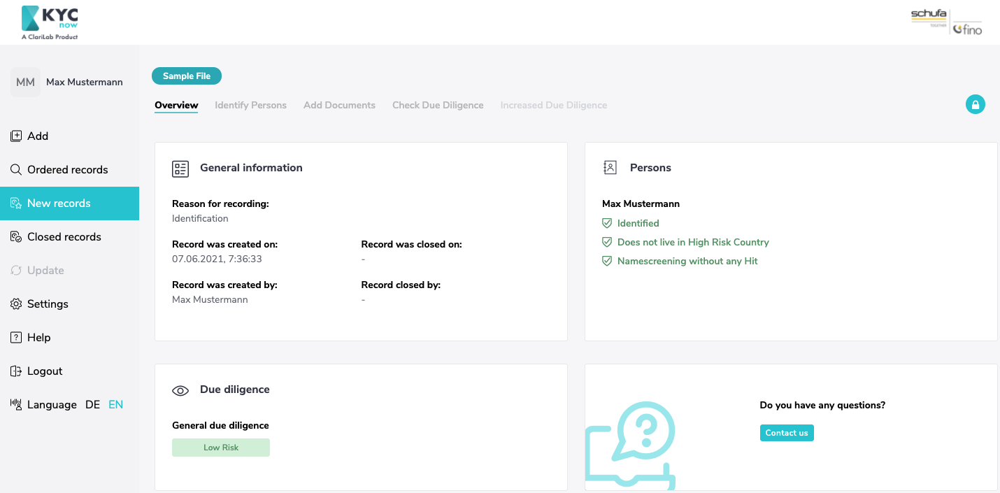
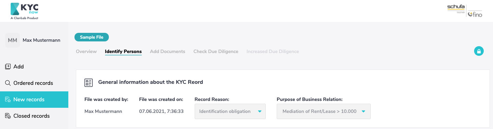
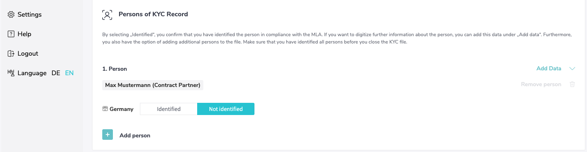
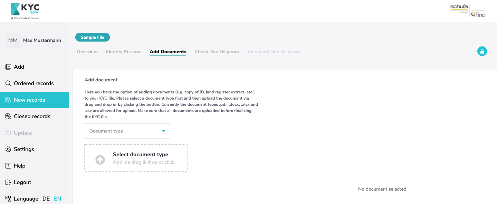
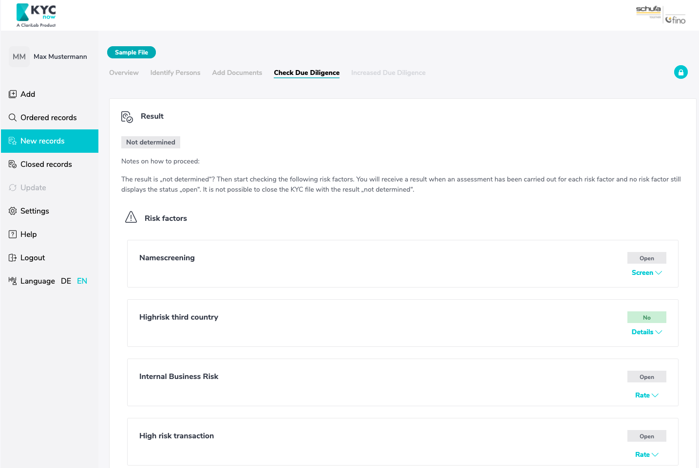

# KYCnow Private Customers Guide
…
**This page is in constant expansion**
…
KYCnow supports you in creating a digital KYC-record for business relationships with natural persons and so helps you to comply with obligations surrounding money laundering.
In order to get started you first must have selected the tab “Private customers” in KYCnow. The tab company customers is provided for companies as business partners.

---

## General sequence

Creating a digital KYC-record for a business relationship with natural Persons consists of the following steps:

1. Create a record
2. Obtaining all necessary data and documents
3. Risk check
4. Fulfilling increased due diligence in case of high risk
5. Audit-proof filing of the record

For each step KYCnow provides functionalities. To begin with a new KYC-record must be created. This is possible in the page list on the left. All created records can be found in “New records”. Is the record closed it is moved to “Closed records”.

By clicking on a record name either under “New records” or under “Closed records” you can view the respective record.
It is divided into several sections which you can navigate using the tabs placed in the upper hand side.
The order of the tabs starts with an overview and then follows the logical steps of the check from left to right.
First all Data and Documents must be gathered in the corresponding folder. Following this the risk assessment can be found under “Check Due Diligance”. In case of high risk the corresponding tab “Increased Due Diligence” is to be filled in.
Once all steps have been carried out, the record can be closed.

To guarantee maximal flexibility KYCnow does not require a strict succession of the steps. It is possible to add or change Data and determine the risk again. The general succession is merely a recommendation.

---

## KYCnow Private customers, a Step for Step Guide

In this Section each Step, from creating a record to its audit-proof filing, will be described in detail.

---

### Add a record

To start a new KYC-Process, a new record has to be created. In order to do so, select the tab “Add” and make sure that KYCnow is set for “Private customers”. You should now see the following Screen:

First give your record an individual name. Additionally, please choose the purpose of the business relation, whether you are brokering a purchase contract or a rental/lease contract with a monthly payment >10.000€
Next, we ask you to declare whether your contracting party is an individual or a group of persons.  By selecting the type of contracting party additional fields appear in which you are asked to give more information on the contracting Party:
The necessary information is:

- First name
- Last name
- Acting for own account or acting for account of a third party
- Country of residence

Further information is to be given later on.

If you are creating a record for a group of persons, you can add several persons to the contract party group. This may be the case, for example, in a real estate transaction with spouses. This group can be as large as you like and can be expanded using the “Add”-Button or reduced using the wastebasket-icon.

---

**Please note that persons, with whom the record was created, cannot be removed of the record going forward. The same goes for the business purpose. Further persons can always be added, later on.**

---

Once you click “create record” the record is moved to “New records” while you are automatically forwarded to the next necessary step “Identify Persons”

---

### Overview

Here all relevant information can be found in a compressed fashion. You can also view the current status of processing here at any time, e.g. whether all persons have already been identified or whether the amount of due diligence has already been determined. Further steps start under the tab “Identify Persons”

---

### Identify Persons

Here you have the possibility to gather the relevant data of all persons involved in the KYC-Process.
At the top you are given unchangeable general information about the record, namely who created it, the time when the record was created, as well as the reason for the record (here the reason "identification" is preselected) and the purpose of the business relationship.

Beneath you will find the person(s) with whom the record was created. While they cannot be fully removed from the file anymore, you can still add additional basic data. Thus a record always consists of at least one person in the role as contract partner.

By clicking on “Add Data” further additional fields will appear in which you can record the data necessary for identification.

More persons can be added using the “Add Person”-Button at the bottom end of the page.
When you add another person to a business relationship with a single person, the added person can be assigned one of the following roles:

- Contracting party
- Acting person for contractor
- Ultimate beneficial owner

In the case of a business relationship with a group of persons, you can add further persons to the group of persons; these are automatically assigned a role as contract partner.
Under "Persons in the KYC file", you can also add persons who are not members of the group of persons. Here you can assign one of the following roles to the persons:

- Contracting party
- Acting person for contractor
- Ultimate beneficial owner

**Persons added in this manner can removed again.**

Please add all persons in their respective rolls who are involved in the initiation of the business.

Once you have identified a person to your satisfaction and filled in the according fields, please mark this person as “Identified”. Under the tab “Overview” you can always see, who has already been identified and who hasn’t.
As long as a record hasn’t been closed, you can make changes to the data.

---

### Add documents

The tab “Add Documents” is the document archive belonging to the individual KYC-Record. Here you can select the document type, be it an “Identification document”, a “credit document” or any “other document” and upload the corresponding document.

---

### Check Due Diligence

Once you have collected all the data and documents for your new KYC file, you can determine the money laundering risk of the file under the "Check due diligence" tab on the basis of several risk factors. The resulting risk determines the due diligence to be performed.

If you have created a new file, the risk is set as "Not determined". To determine the risk, all risk factors must be checked.
**Only once all risk factors have been checked can the money laundering risk of a file be determined, and the file closed.**

1. Name Screening

All persons added to the file are screened against over 1200 PEP, sanctions, watch and blacklists. To do this, press the "Start Screening" button. Any hits will be displayed to you with necessary details.
It is up to you to determine whether a hit is relevant or not.

The results are divided according to the lists for which a hit was found.
The list types are:

- PEP lists (Politically Exposed Persons)
- Sanctions / embargo lists
- Watch / Blacklists

This also means, for example, that a hit can be found both for sanctions / embargo lists and for watch / black lists.

If you add new persons to the file in the course of the KYC check, the screening must be performed again.

2. High risk third country

All **countries of residence** of all persons added in the Persons tab are automatically screened against a stored list of high risk third countries. This list is in accordance with the European Commission Regulation which identifies high risk third countries.

3. Internal Business Risk

Here you can record an identified internal company risk according to your risk analysis. If you identify an internal risk, you can describe it in more detail in the "Enhanced due diligence" tab.

4. High risk transaction

Here you can note if the transaction in your KYC process is a complex, large or unusual transaction, or a transaction with no obvious commercial or legitimate purpose. If this is the case, you can describe the transaction more specifically in the "Enhanced due diligence" tab

If all four risk factors have been processed, the result of the check appears above.

If a "general due diligence" has been determined, you can close the file by clicking on the lock icon at the top right.

If a high risk of money laundering has been identified, you will need to complete the next tab "Enhanced due diligence".

---

### Enhanced due diligence

This tab will only appear if a high money laundering risk has been identified based on the risk factors.
If an increased risk of money laundering has been determined, you may only establish the business relationship if you can execute the enhanced due diligence.
Documents that you collect in the course of the enhanced due diligence can be filed under the "Documents" tab.

Only those risk factors are shown for which an increased risk was previously identified under the "Check due diligence" tab.

Consequently, there are the following reasons for increased due diligence:

#### Internal risk

If an internal company risk has been identified, enhanced due diligence requires you to also describe the facts of the case and verify and substantiate the source of funds.
In addition, approval of the business relationship by a supervisor is required.

#### High Risk Transaction

If you have identified a high-risk transaction, you may first distinguish between (1) a complex or large-volume transaction, (2) an unusual transaction, or (3) a transaction with no apparent economic purpose.
In addition, describe the transaction.

#### High Risk State

If your contractual partner is domiciled in a high-risk third country, the Money Laundering Act stipulates that the source of funds of the person must be verified and substantiated.
Again, approval of the business relationship by a supervisor is required.

#### Namescreening

If the name screening of your contractual partner has revealed that this person is a politically exposed person (PEP), the origin of the funds must be checked and documented.
In addition, a release of the business relationship by the supervisor is required.
If the person is on a sanctions/embargo list, you may not enter into the business relationship.

---

### Inventory and Export

Once you have determined the money laundering risk and have performed any necessary enhanced due diligence, you can close the file by clicking on the lock icon in the upper right corner.
In closing the file, it is automatically saved in an audit-proof manner and moved to "Closed records". For this reason no changes can be made to the file once it has been closed.
Furthermore, once you have closed the file you can export it as a PDF-File.