# Schnellstart

---

**Diese Seite befindet sich in stetiger Erweiterung!**

---

KYCnow ermöglicht Ihnen einen automatischen Abzug aller KYC-relevanten Daten / Dokumente und macht Ihnen diese über eine Schnittstelle oder eine Web-Anwendung zugänglich. Diese Daten / Dokumente werden von KYCnow aufbereitet und ausgewertet, um eine Empfehlung über das Geldwäsche-Risiko Ihres (potentiellen) Kunden zu liefern.

Die Daten / Dokumente erhält KYCnow über Schnittstellen zu Schufa, landesspezifischen Handelsregistern, dem
Transparenzregister sowie Dun&Bradstreet für Unternehmen die international verzweigt sind. Diese Daten / Dokumente werden in KYCnow abgelegt und sind für Sie jederzeit einsehbar. Um ein neues Unternehmen in den Prozess aufzunehmen, steht ein Onboarding bereit, welches sowohl vom Ihnen als auch Ihrem Endkunden  durchgeführt werden kann.

## Fall anlegen

Um eine neue KYC-Akte zu eröffnen, müssen Sie zunächst einen Fall anlegen.
Mit Eingabe des zu überprüfenden Unternehmen in die Suchleiste können Sie aus einer Trefferliste das gewünschte Unternehmen auswählen.

Haben Sie das gesuchte Unternehmen gefunden, können Sie durch „Hinzufügen“ den Fall neu anlegen und das Unternehmen fortan im Bereich „Neue Fälle“ aufrufen.
Pro Unternehmen kann eine einzige Akte angelegt werden. Ist ein Unternehmen bereits in „Neue Fälle“ oder „Bestand“ vorhanden, kann dieses nicht neu hinzugefügt werden.
Finden Sie das Unternehmen nicht direkt, nutzen Sie bitte die folgend beschriebene erweiterte Suche, um die Suchergebnisse mit mehr Details zu konkretisieren.

---

Sollten Sie ergänzende Angaben zum gesuchten Unternehmen haben, können Sie diese in der erweiterten Suche angeben, um so schneller das gewünschte Unternehmen zu ermitteln. Klicken Sie für das erweitern der Suche rechts neben der Länderauswahl auf "Erweiterte Suche". Die Suche wird sich nun ausklappen.

Mögliche Angaben sind dabei:

- Der Name des Unternehmens
- Inhaber:in des Unternehmens
- Branchenschlüssel
- Straße / Postleitzahl / Ort
- Handelsregisternummer
- LEI-Nummer
- Anbieter ID (Schufa ID oder DUNS Number für Gesellschaften mit Sitz im Ausland)
- Umsatzsteuer-ID

Auch hier können Sie anschließend durch „Hinzufügen“ eine neue Akte anlegen und das Unternehmen fortan im Bereich „Neue Fälle“ abrufen.

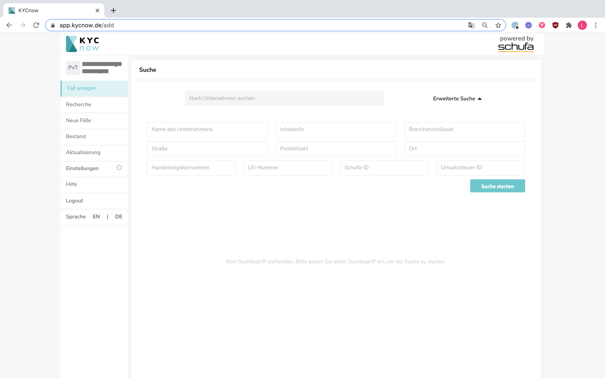

Bitte lesen Sie den folgenden Abschnitt "Recherche", falls keines der angezeigten Suchergebnisse zu dem von Ihnen gesuchten Unternehmen passt.

---

## Recherche

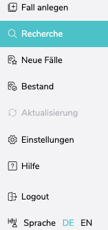

Sollte das von Ihnen gesuchte Unternehmen nicht gefunden werden, haben Sie die Möglichkeit eine manuelle Recherche für dieses Unternehmen anzufordern. Hier entstehen keine zusätzlichen Kosten. Das Unternehmen wird auf Existenz geprüft und ist künftig in der Suche zu finden.
Drücken Sie bitte hierfür auf „Manuelle Recherche anfordern“. Dieser Button erscheint erst am unteren Ende des Bildschirms, sobald Sie mindestens eine erweiterte Suche ausgeführt haben.

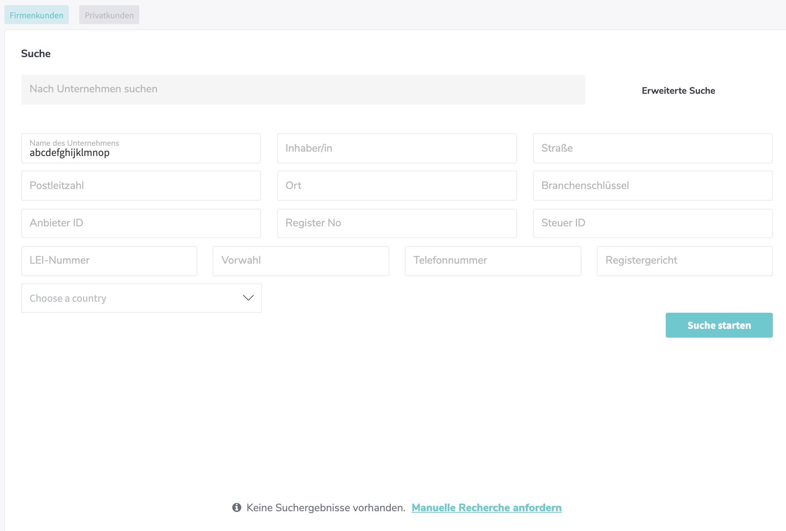

Zur manuellen Recherche müssen alle nun abgefragten Felder ausgefült werden. Geben Sie, falls möglich, einen Existenzbeleg, z.B. einen Gewerbeschein in Form einer PDF hinzu.

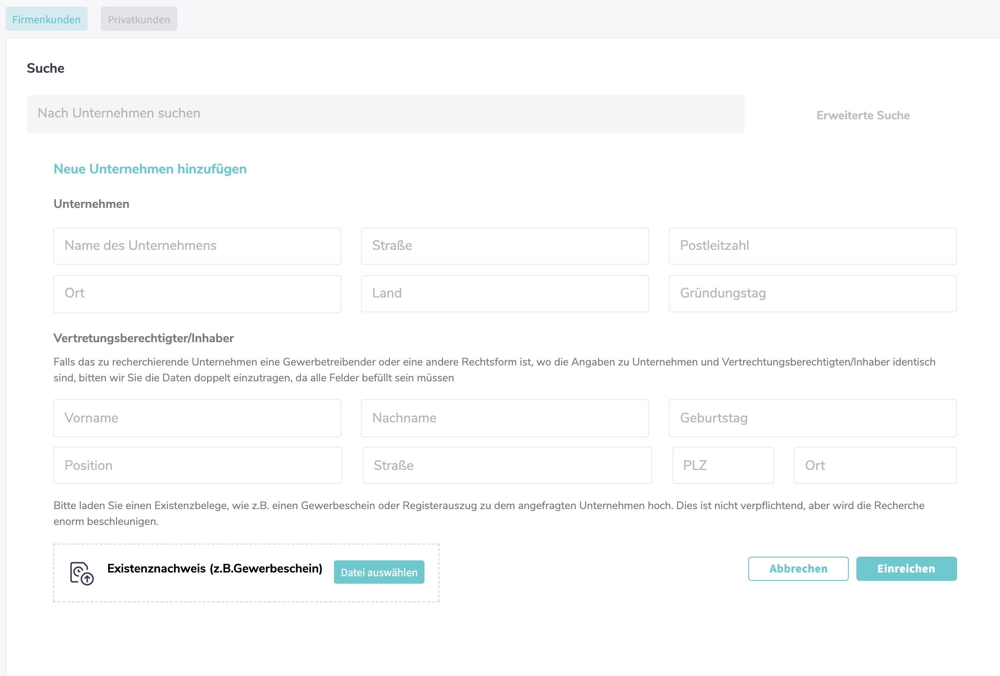

Die manuelle Bearbeitung einer Anfrage dauert wenige Werktage. Sie wird üblicherweise deutlich schneller beendet, wenn Sie einen Existenznachweis in Form einer PDF hinzugefügen.
Haben Sie eine manuelle Recherche angefordert, ist das Unternehmen für die Dauer der Recherche im Reiter „Recherche“ aufgelistet.

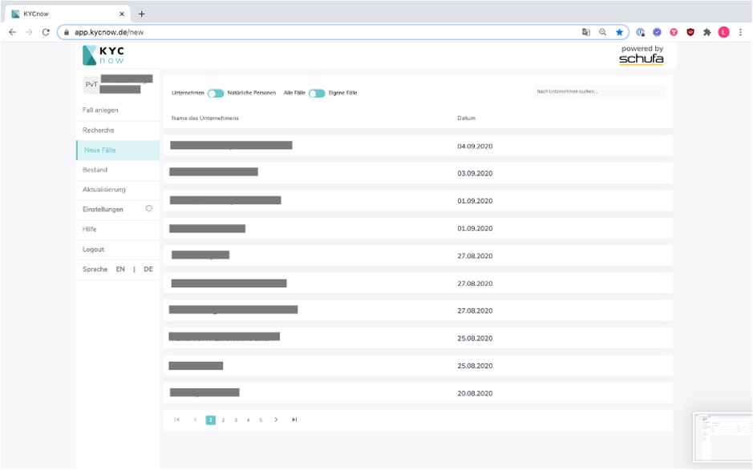

Sie erhalten eine Benachrichtigung per Mail, sobald die manuelle Recherche beendet ist. Daraufhin ist das Unternehmen im Reiter "Neue Fälle" zu finden.

---

## Neue Fälle

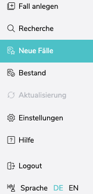

Im Bereich „Neue Fälle“ finden Sie sämtliche KYC-Akten, die noch nicht abgeschlossen sind. Angezeigt wird neben dem Namen des jeweiligen Unternehmens auch das Datum zu dem der Fall angelegt wurde sowie die automatisch errechnete KYC-Risikoeinstufung.
Sie können mit Hilfe der Buttons eine Auswahl der angezeigten Fälle vornehmen.Es kann ausgewählt werden zwischen:

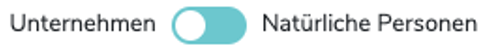

und

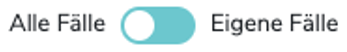

(Einsicht in „Alle Fälle“ nur als Administrator möglich, falls nicht jeder User Ihres Unternehmens grundsätzlich dazu berechtigt ist)

Mit Hilfe der Suchleiste ist es möglich nach einem Fall zu suchen.
Durch Anklicken einer Akte gelangen Sie zur jeweiligen Akten-Übersicht.

---

### Übersicht eines KYCnow-Falls

Nach der Auswahl eines spezifischen Falls, gelangen Sie zunächst zu seiner Aktenübersicht.
In der Aktenübersicht werden alle relevanten Informationen zu dem Unternehmen, den natürlichen Personen, dem Name Screening sowie dem KYC-Score angezeigt.
Über die einzelnen Reiter können Sie nähere Informationen aufrufen und / oder bearbeiten.
Eigene Kommentare können Sie dem Fall beifügen, indem Sie folgenden Icon im Bereich oben rechts anklicken:

---

### Stammdaten

In den Stammdaten befinden sich generelle Informationen zu dem zu überprüfenden Unternehmen, seinen Kommunikationsdaten sowie seiner Tätigkeit.
Sollte eine Aktualisierung bzw. Erweiterung der Daten erforderlich sein können Sie unten eine Recherche anfordern.

---

### Personen

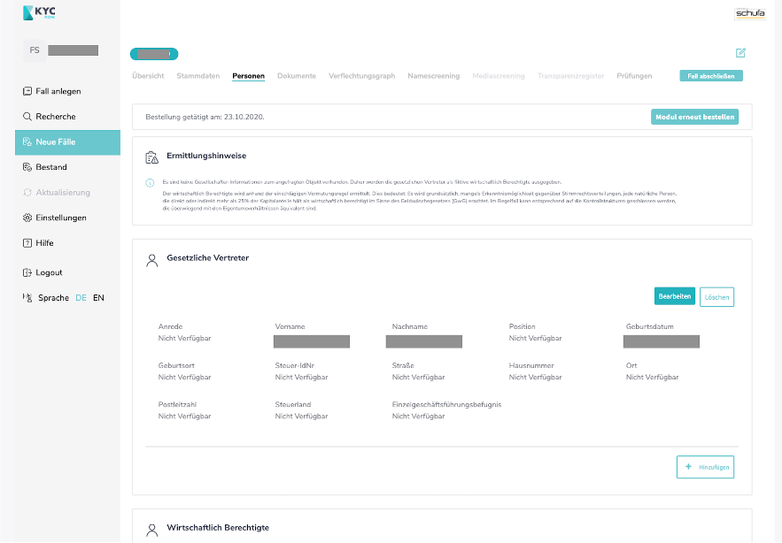

Hier finden Sie alle notwendigen Informationen zu den gesetzlichen Vertretern sowie den wirtschaftlich Berechtigten.
Auch hier können Sie unten durch klicken auf Recherche anfordern eine Aktualisierung / Erweiterung der Daten beantragen.

Außerdem finden Sie hier, falls es sich um ein internationales Unternehmen handelt, das Ermittlungsprotokoll.

---

### Dokumente

Über den Reiter Dokumente können Sie folgende Dokumente bestellen und herunterladen:

- Schufa-Auskünfte:
  
  GwG-Vollauskunft, -Kompaktauskunft, -Kurzauskunft

  **Für internationale Unternehmen gibt es keine GwG-Auskunft der SCHUFA.
  Dass Ermittlungsprotokoll können Sie unter dem Reiter "Personen" abrufen.**

- Basierend auf Handelsregister:

  Aktueller Abdruck, chronologischer Abdruck, Gesellschafterliste sowie Gesellschaftervertrag

- Transparenzregister-Auszug

Darüber hinaus können Sie eigene Dokumente hochladen.

---

### Verflechtungsgraph

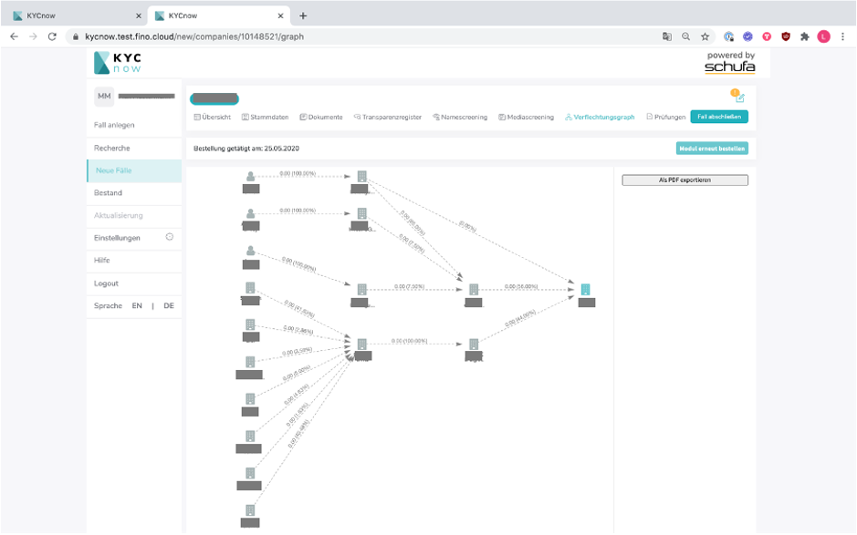

Der Verflechtungsgraph visualisiert all die natürlichen und juristischen Personen, welche direkt oder indirekt an dem angefragten Unternehmen beteiligt sind.
Sie können den Verflechtungsgraph auch zur Visualisierung der Ermittlung der wirtschaftlich Berechtigten nutzen.
Darüber hinaus können Sie den Verflechtungsgraph als PDF speichern.
Bitte beachten Sie, dass keine Stimmrechtsanteile einbezogen werden.

---

### Namescreening

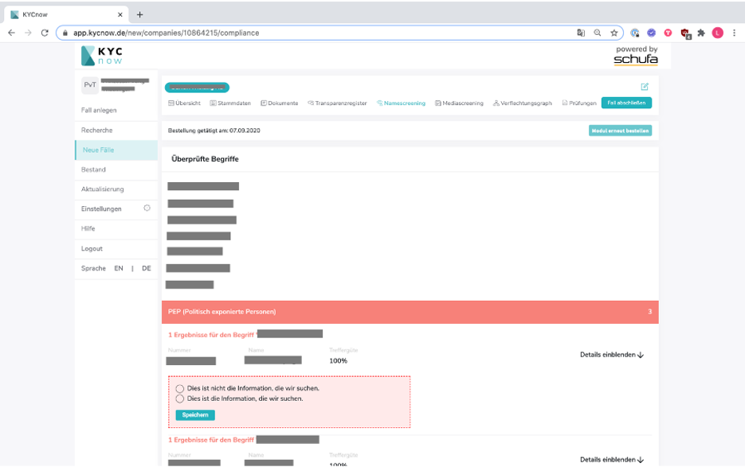
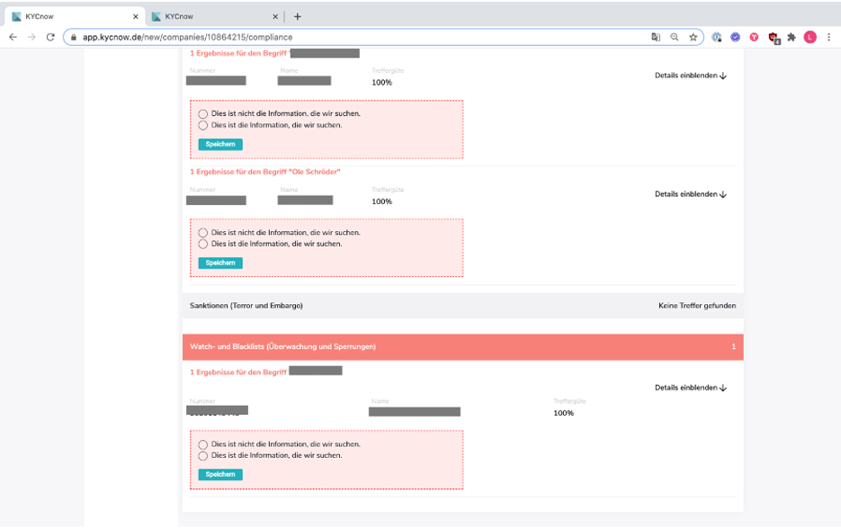

Im Reiter Namescreeening können Sie einsehen, welche Begriffe im Zuge des Namescreenings überprüft wurden und welche Treffer gefunden wurden.
Das Namescreening durchsucht PEP-, Sanktions- (Terror und Embargo), Watch- und Blacklisten nach:

- Dem Unternehmensnamen
- Den Namen der wirtschaftlich Berechtigten des Unternehmens
- Den gesetzlichen Vertretern

Werden keine Treffer gefunden, impliziert dies, dass es den Suchbegriff in keiner der verfügbaren Listen gibt oder angezeigte Informationen als nicht relevant eingestuft wurden.
In den Ergebnissen werden auch ähnliche Namen dargestellt, um Tippfehlerrisiken zu minimieren.
Sie können die Relevanz aller Informationen überprüfen und damit auch ob die Informationen dem Fall beigefügt werden sollen

---

### Mediascreening

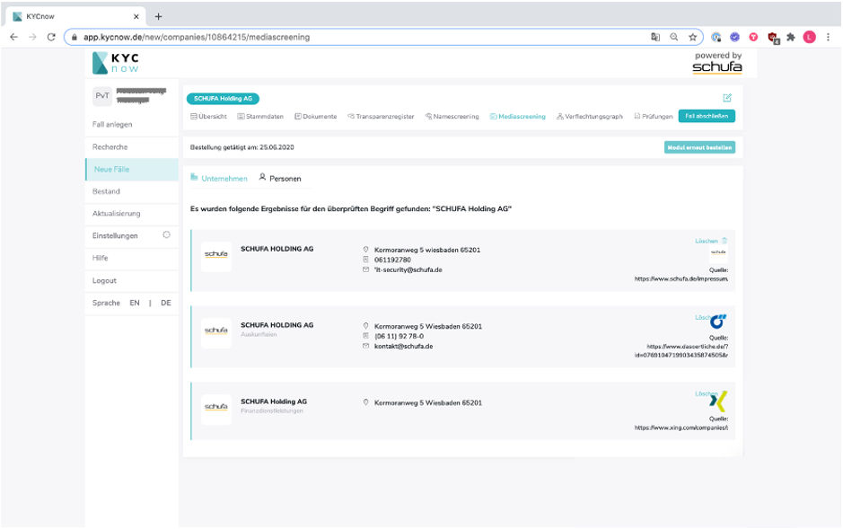
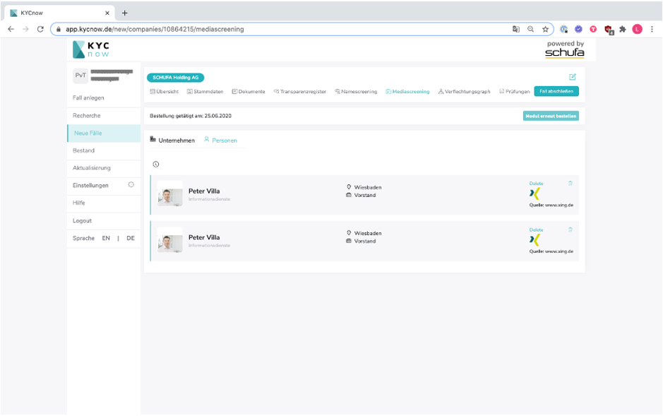

Das Mediascreening sucht nach (Nachrichten-)Artikel, Social-Media-Profilen usw. über das Unternehmen und die natürlichen Personen, welche im Rahmen des KYC Prozesses untersucht werden sollen.

---

### Transparenzregister

Hier können Sie:

- Wirtschaftlich Berechtigte selbstständig oder automatisch hinzufügen
- Unstimmigkeitsmeldungen aufgeben
- Transparenzregisterauszug herunterladen

Einen Guide zum Nutzen des KYCnow-Moduls "Transparenzregister" finden Sie [hier](transparenzregister)

---

### Prüfungen

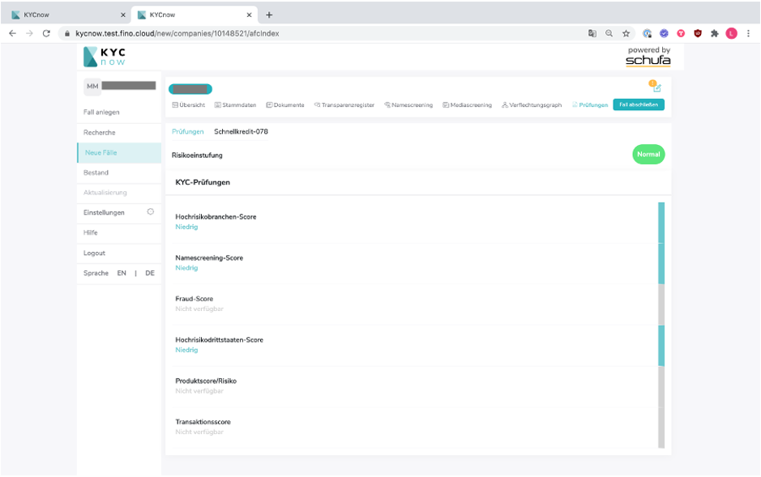

Unter Prüfungen finden Sie die berücksichtigten Faktoren im Einzelnen. Faktoren die berücksichtigt werden sind:

- Branchenzugehörigkeit
- Namescreening
- Fraud Score
- Länder in denen das Unternehmen tätig ist (sowie alle Unternehmen aus dem Verflechtungsgraph)
- Produktscore / Risiko
- Transaktionsscore

---

## Bestand

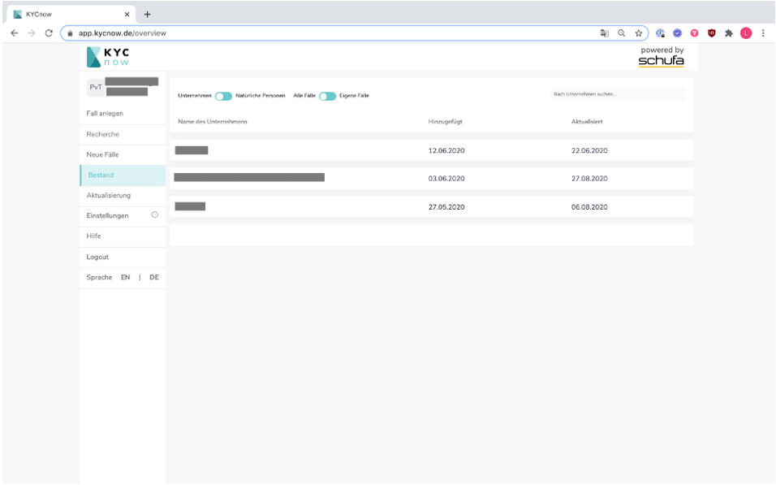

Wenn Sie einen „Fall abschließen“, wird dieser in Ihren Bestand verschoben. Dort wird der Fall revisionssicher eingefroren und gespeichert.

Ist der Fall einmal im Bestand, können keine weiteren Änderungen vorgenommen werden!

Im Register „Bestand“ können Sie sämtliche abgeschlossenen Fälle einsehen.
Auch hier können Sie, wie schon im Reiter „Neue Fälle“, durch klicken auf die jeweiligen Unternehmensnamen die dazugehörige Akte einsehen.

---

## Einstellungen als Administrator

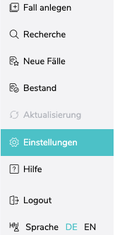

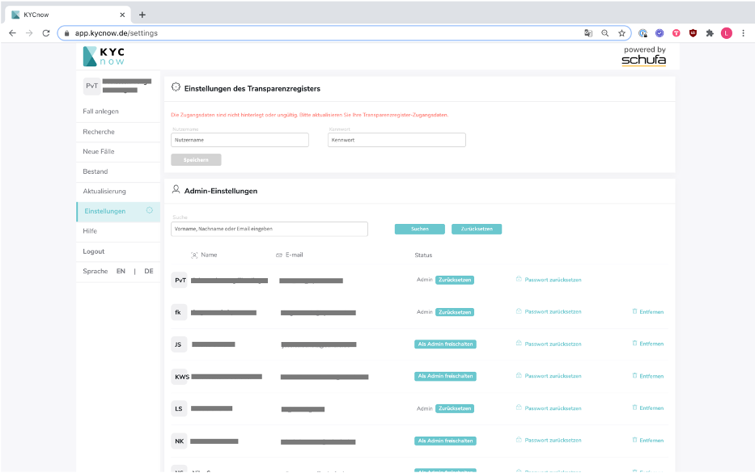

Hier können Sie als Administrator:

- Andere Nutzer als Administratoren freischalten
- Weitere Nutzer hinzufügen oder entfernen
- Passwörter zurücksetzen

Als Administrator können Sie außerdem zwischen allen KYCnow-Fällen sowie den eigenen Fällen wechseln.

Andere Nutzer sehen nur diejenigen KYCnow-Fälle, die sie selbst angelegt haben

---

## Einstellungen für das Transparenzregister

Hier müssen Sie Ihre Transparenzregister Zugangsdaten hinterlegen damit Bestellungen in das Transparenzregister direkt über die Plattform erfolgen können
