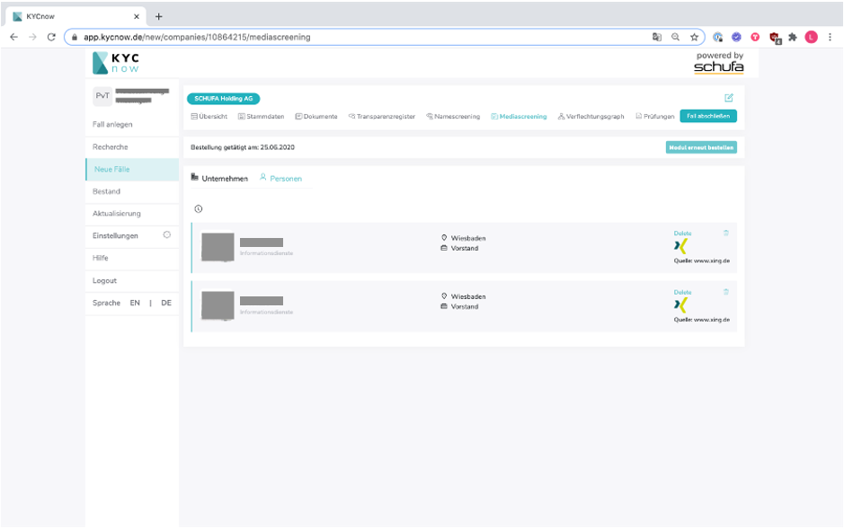

# Schnellstart

---

**WIP: Dieses Dokument befindet sich gerade noch in Arbeit!**

---

KYCnow ermöglicht einen automatischen Abzug aller KYC- relevanten Daten und Dokumente, um diese dem Nutzer über eine Schnittstelle oder eine Web-Anwendung zugänglich zu machen. Diese Daten und Dokumente werden von KYCnow aufbereitet und ausgewertet, um dem Nutzer eine Empfehlung über das Geldwäsche-Risiko eines potentiellen Kunden zu liefern.

Die Daten und Dokumente erhält KYCnow über eine Schnittstelle zur Schufa, zu den landesspezifischen Handelsregistern, zu dem
Transparenzregister sowie zu Dun&Bradstreet für Unternehmen die international tätig sind. Diese Daten und Dokumente werden gespeichert und sind für den Kunden jederzeit zugänglich. Um ein neues Unternehmen in den Prozess aufzunehmen, steht ein Onboarding bereit, welches sowohl vom Endkunden als auch vom Kundenberater durchgeführt werden kann.

## Fall anlegen

Um einen neuen KYC-Prozess zu beginnen müssen Sie zunächst einen Fall anlegen.
Mit Eingabe des zu überprüfenden Kunden in die Suchleiste können sie aus einer Trefferliste das gewünschte Unternehmen aussuchen.

Haben Sie das gesuchte Unternehmen gefunden, können Sie durch „Hinzufügen“ den Fall neu anlegen und das Unternehmen fortan im Bereich „Neue Fälle“ aufrufen.

---

Sollten Sie genaue Angaben zum gesuchten Unternehmen haben, können Sie diese in der Erweiterten Suche angeben um so schneller das gewünschte Unternehmen zu ermitteln.

Mögliche Angaben sind dabei:

- Der Name des Unternehmens
- Inhaber/in des Unternehmens
- Branchenschlüssel
- Straße / Postleitzahl / Ort
- Handelsregisternummer
- LEI-Nummer
- Schufa-ID
- Umsatzsteuer-ID

Auch hier können Sie anschließend durch „Hinzufügen“ eine neue Akte anlegen und das Unternehmen fortan im Bereich „Neue Fälle“ abrufen.

---

## Recherche

Sollte das von Ihnen gesuchte Unternehmen nicht gefunden werden, haben Sie die Möglichkeit eine manuelle Recherche für dieses Unternehmen anzufordern. Drücken Sie bitte hierfür auf „Manuelle Recherche anfordern“.
Zur manuellen Recherche, müssen alle Felder der erweiterten Suche ausgefüllt worden sein.
Die manuelle Bearbeitung einer Anfrage dauert einige Werktage.
Haben Sie eine manuelle Recherche angefordert, ist das Unternehmen für die Dauer der Recherche im Reiter „Recherche“ aufgelistet.

---

## Neue Fälle

Im Bereich „Neue Fälle“ finden Sie sämtliche begonnene KYC-Prozesse, die noch nicht abgeschlossen sind. Angezeigt wird neben dem Namen des jeweiligen Unternehmens auch das Datum an dem der Fall angelegt wurde, sowie die automatisch errechnete KYC-Risikoeinstufung
Sie können mit Hilfe der Auswahlleiste eine grobe Sortierung der laufenden Fälle vornehmen. Es kann sortiert werden zwischen:

und

(Einsicht in „Alle Fälle“ nur als Administrator möglich)

Sie können außerdem auch mithilfe der Suchleiste nach einem laufenden Fall suchen.
Durch anklicken eines Falls gelangen Sie zur jeweiligen Übersicht.

---

### Übersicht eines KYCnow-Falls

Nach auswählen eines spezifischen Falls, gelangen Sie zunächst zu seiner Schnellübersicht.
In der Schnellübersicht werden alle relevanten Informationen zu dem Unternehmen, den natürlichen Personen, dem Name Screening sowie dem KYC-Score angezeigt.
Über die einzelnen Reiter können Sie nähere Informationen aufrufen und / oder bearbeiten.
Eigene Kommentare können Sie dem Fall beifügen, indem Sie oben rechts folgenden Icon anklicken.

---

### Stammdaten

In den Stammdaten befinden sich generelle Informationen zu dem zu überprüfenden Unternehmen, seinen Kommunikationsdaten und seiner Tätigkeit.
Sie finden hier auch detaillierte Informationen zu den gesetzlichen Vertretern sowie den wirtschaftlich Berechtigten.
Auch mögliche Ermittlungsabbrüche und deren Gründe werden in den Stammdaten angezeigt.
Sollte eine Aktualisierung bzw. Erweiterung der Daten erforderlich sein können sie unten eine Recherche anfordern.

---

### Dokumente

Über den Reiter Dokumente können Sie folgende Dokumente bestellen und herunterladen:

- Basierend auf Schufa:
  
  GwG-Vollauskunft, -Kompaktauskunft, -Kurzauskunft

- Basierend auf Handelsregister:Aktueller Abdruck, Chronologischer Abdruck, Gesellschafterliste sowie Gesellschaftervertrag

- Transparenzregister-Auszug

Sie können außerdem auch alle Handelsregisterauszüge und andere Dokumente hochladen.

---

### Transparenzregister

Hier können Sie:

- Wirtschaftlich Berechtigte selbstständig oder automatisch hinzufügen
- Unstimmigkeitsmeldungen aufgeben
- Dokumente des Transparenzregisters herunterladen

Einen Guide zum Nutzen des KYCnow-Moduls "Transparenzregister" finden Sie [hier](#transparenzregister)

---

### Namescreening

Hier können Sie einsehen, welche Begriffe im Zuge des Namescreenings überprüft wurden und welche Treffer gefunden wurden.
Das Namescreening durchsucht PEP-, Sanktions- (Terror und Embargo), Watch- und Blacklisten nach:

- Dem Unternehmensnamen
- Den Namen der wirtschaftlich Berechtigten des Unternehmens
- Den gesetzlichen Vertretern

Werden keine Treffer gefunden, impliziert dies, dass es den Suchbegriff in keiner der verfügbaren Listen gibt, oder angezeigte Informationen als nicht relevant eingestuft wurden.
In den Ergebnissen werden auch ähnliche Namen dargestellt, um Tippfehlerrisiken zu minimieren.
Sie können die Relevanz aller Informationen überprüfen und damit auch ob die Informationen dem Fall beigefügt werden sollen

---

### Mediascreening

Das Mediascreening sucht nach (Nachrichten-)Artikel, Social-Media-Profilen, usw. über das Unternehmen und die natürlichen Personen, die im Rahmen des KYC Prozesses untersucht werden sollen.

---

### Personen

Hier finden Sie alle notwendigen Informationen zu den gesetzlichen Vertretern sowie den wirtschaftlich Berechtigten
Auch hier können Sie unten durch klicken auf Recherche anfordern eine Aktualisierung / Erweiterung der Daten beantragen.

---

### Verflechtungsgraph

Der Verflechtungsgraph visualisiert all die natürlichen und juristischen Personen, die direkt oder indirekt an dem Hauptunternehmenskapital beteiligt sind.
Sie können den Verflechtungsgraph auch zur Visualisierung der Ermittlung der wirtschaftlich Berechtigten nutzen.
Sie können den Verflechtungsgraph auch als PDF speichern.
Bitte beachten Sie, dass wir keine Stimmrechtsanteile miteinbeziehen.

---

### Prüfungen

Unter Prüfungen finden Sie die berücksichtigten Faktoren im Einzelnen. Faktoren die berücksichtigt werden sind:

- Branchenzugehörigkeit
- Namescreening
- Fraud Score
- Länder in denen das Unternehmen tätig ist (sowie alle Unternehmen aus dem Verflechtungsgraph)
- Produktscore / Risiko
- Transaktionsscore

---

## Bestand

Wenn Sie einen „Fall abschließen“, wird dieser in Ihren Bestand verschoben. Dort wird der Fall revisionssicher eingefroren und gespeichert.

Ist der Fall einmal im Bestand, können keine weiteren Änderungen vorgenommen werden!

Im Register „Bestand“ können Sie sämtliche abgeschlossenen Fälle einsehen.
Auch hier können Sie, wie schon im Reiter „Neue Fälle“, durch klicken auf das jeweilige Unternehmen die gespeicherten Informationen einsehen.

---

## Einstellungen als Administrator

Hier können Sie als Administrator:

- Andere Nutzer als Administratoren freischalten
- Weitere Nutzer hinzufügen oder entfernen
- Passwörter zurücksetzen

Als Administrator können Sie außerdem zwischen allen KYCnow-Fällen sowie den eigenen Fällen wechseln.

Andere Nutzer sehen nur diejenigen KYCnow-Fälle, die sie selbst angelegt haben

---

## Einstellungen für das Transparenzregister

Hier müssen Sie Ihre Transparenzregister Zugangsdaten hinterlegen damit Bestellungen in das Transparenzregister direkt über die Plattform erfolgen können
