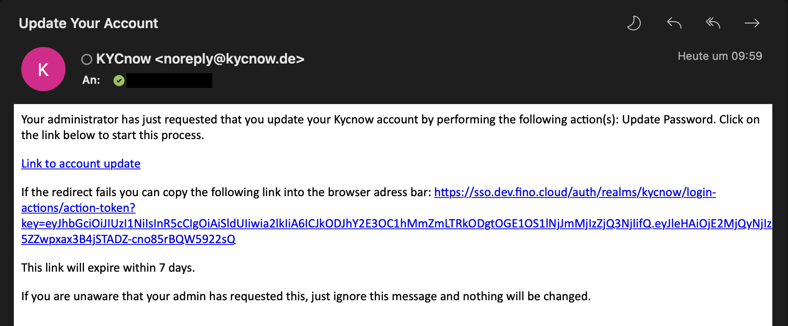

# Testing KYCnow Webanwendung

Um Ihnen einen umfangreichen Eindruck der KYCnow-Plattform zu ermöglichen, bietet KYCnow verschiedene Testszenarien an. Dieser Artikel behandelt die beiden fachlichen Test-Arten, welche über die KYCnow-**Weboberfläche** durchführbar sind. Technische Tests zur Implementierung sind an anderer Stelle beschrieben.

Grundsätzlich ist in der KYCnow-Webanwendung zwischen Funktions- und Datentests zu unterscheiden. Funktionstests zielen darauf ab, die KYCnow-Oberfläche hinsichtlich ihrer Nutzerführung und verschiedenen Module testen zu können. Datentests fokussieren sich auf die Qualität der durch die agierenden Auskunfteien angebotenen Datensätze. In diesem Fall dient KYCnow lediglich als Medium zur Bereitstellung und Visualisierung.

Es folgt eine detailliertere Beschreibung beider Testmöglichkeiten.

## Funktionstest

Im Rahmen eines Funktionstests erhalten Sie Zugang zur KYCnow-**Testumgebung**. Der wichtigste Unterschied zwischen Test- und Live- bzw. Produktionsumgebung besteht darin, dass auf der Testumgebung lediglich fiktive Firmen mit KYCnow abgefragt werden können.

Sie erhalten Ihre Zugangsdaten zur Testumgebung entweder direkt von Ihrem Ansprechpartner oder via Mail mit einem Link zur Passworterstellung vom Absender **"noreply@kycnow.de"**. Diese Mail sieht je nach dem von Ihnen genutzten Mail-Programm und Spracheinstellungen rudimentär aus. Im Folgendem sehen Sie einen Screenshot der Mail. Schauen Sie bitte auch in Ihrem Spam-Ordner nach, falls Sie keine Mail erhalten haben sollten.

Sie können sich nun mit Ihrer Mail-Adresse und Ihrem gesetzten Passwort auf **www.app.test.kycnow.de** in die KYCnow-Testumgebung einloggen. In ihrer Funktionalität verhält sich die Testumgebung analog zur Produktionsumgebung. Die grundsätzliche Nutzung von KYCnow ist in den beiden folgend verlinkten Artikeln erklärt:

- [Schnellstart - Firmenkunden](schnellstart)
- [Schnellstart - Privatpersonen](retail)

Abschließend sei auf eine Besonderheit der Testumgebung für die Prüfung von Firmenkunden hingewiesen: Während die Unternehmenssuche zwar auch real existierende Firmen als Suchergebnisse ausgibt, werden Sie Fehlermeldungen erhalten, wenn Sie Prüfungen für diese Firmen durchführen wollen. Dieses Verhalten ist dadurch begründet, dass die Unternehmenssuche zur Veranschaulichung für eine Teilmenge von real in Deutschland existierenden Firmen funktioniert. Die letztendliche Prüfung der Firmen und der Abruf der verschiedenen Module in KYCnow funktioniert allerdings nur für ausgewählte fiktive Testfirmen. Diese sind folgend aufgelistet:

- Buchverlagsgesellschaft Druck mbH, Schillerstr. 52-60, 60326 Frankfurt am Main
- Hofwerkstatt Grusel GmbH, Felix-Wankel-Str. 4, 60326 Frankfurt am Main
- Sommertraum Wunsch GmbH, Adenauerallee 103, 45894 Gelsenkirchen
- Schulz Lebensmittel e.K., Komödienstraße 54, 50667 Köln
- Klopfer und Pan Pflegedienst Gesellschaft mbH, Europapl. 17, 52068 Aachen
- Hauskauf + Immobilien GmbH, Spaldingstraße 70, 20097 Hamburg
- Fairness GmbH, Pennrichstraße 9, 55411 Bingen
- Kultur Service GmbH, Schloß Lichtenstein 1, 72805 Lichtenstein
- Vistel AG & Co. KG, Thomas-Meier-Str. 63, 45156 Mayen

Wenden Sie sich gerne bei weiteren Fragen an Ihren Ansprechpartner.

## Datentest

Haben Sie gegenüber Ihrem Ansprechpartner einen Datentest in Auftrag gegeben, wird Ihnen dieser in der KYCnow-Weboberfläche zur Verfügung gestellt. Sie erhalten Ihre Zugangsdaten entweder direkt von Ihrem Ansprechpartner oder via Mail mit einem Link zur Passworterstellung vom Absender **"noreply@kycnow.de"**. Diese Mail sieht je nach dem von Ihnen genutzten Mail-Programm und Spracheinstellungen rudimentär aus. Im Folgendem sehen Sie einen Screenshot der Mail. Schauen Sie bitte auch in Ihrem Spam-Ordner nach, falls Sie keine Mail erhalten haben sollten.

Sie können sich nun mit Ihrer Mail-Adresse und Ihrem gesetzten Passwort auf **www.app.kycnow.de** einloggen. Die für den Datentest beauftragten Firmen befinden sich im Reiter **"Bestand"**. Alle anderen Reiter sind für den Datentest deaktiviert. 

Wenden Sie sich gerne bei weiteren Fragen gerne an Ihren Ansprachpartner.
