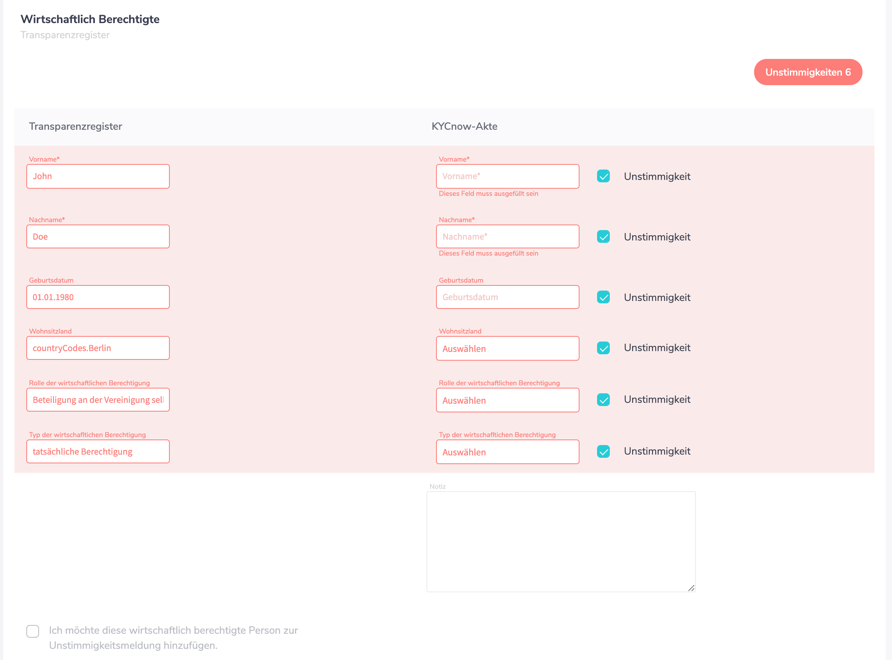
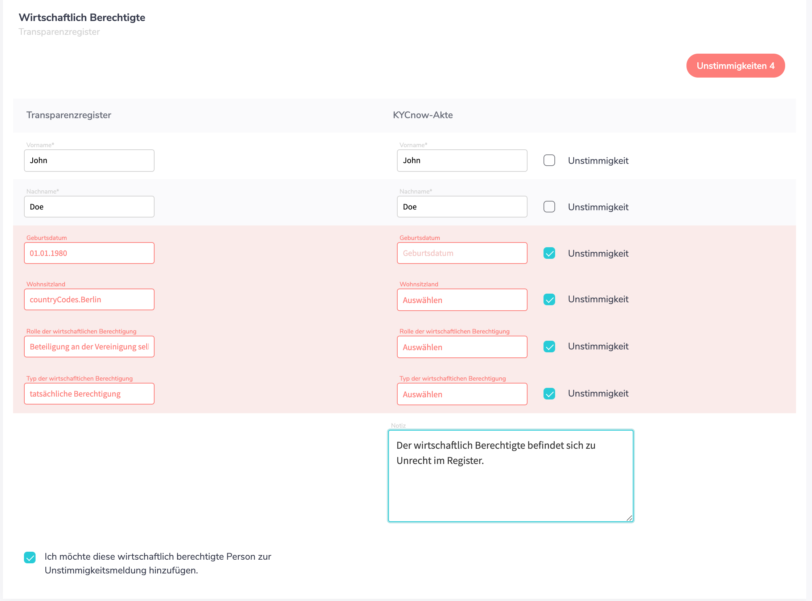
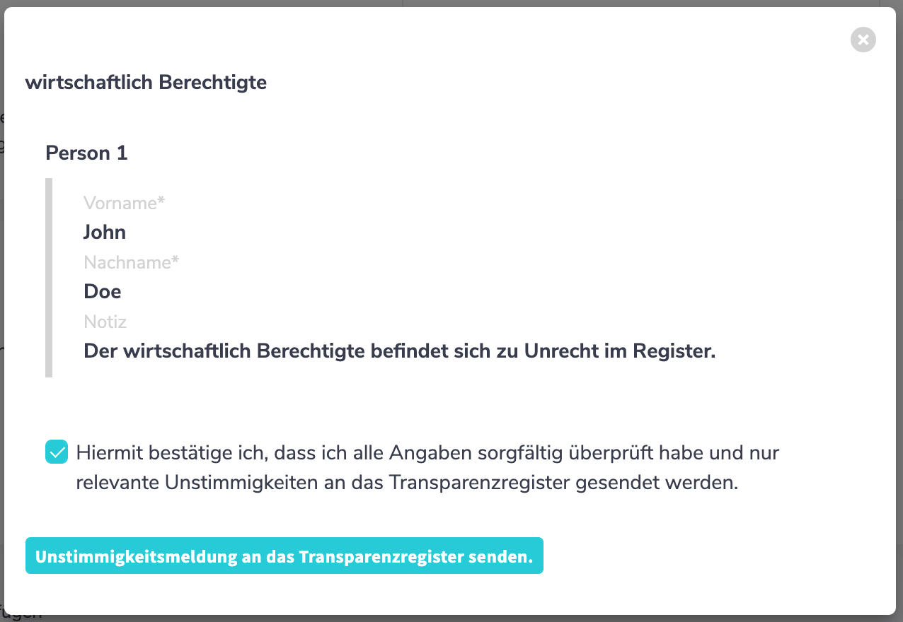
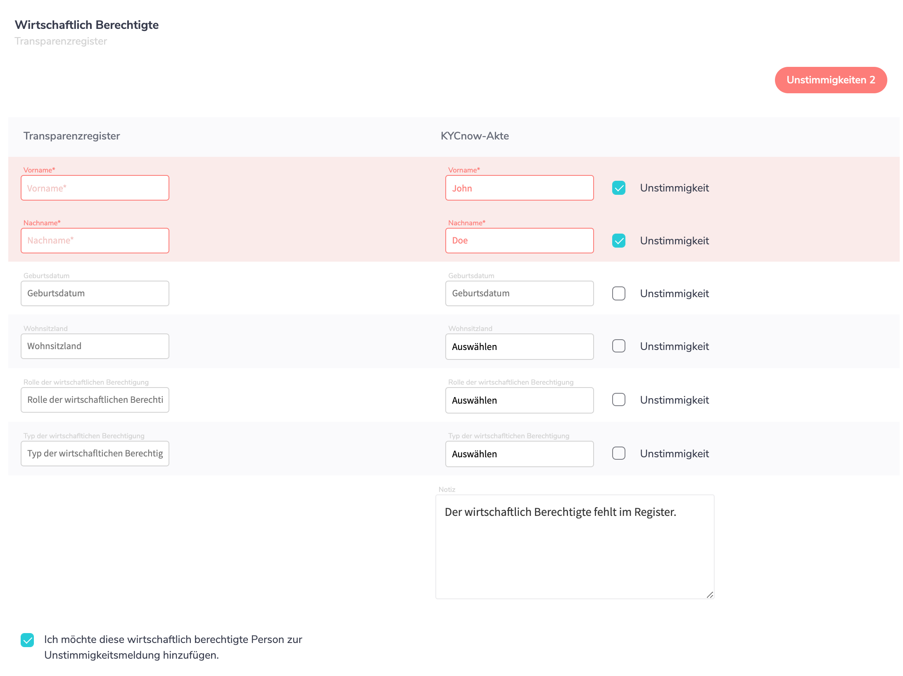
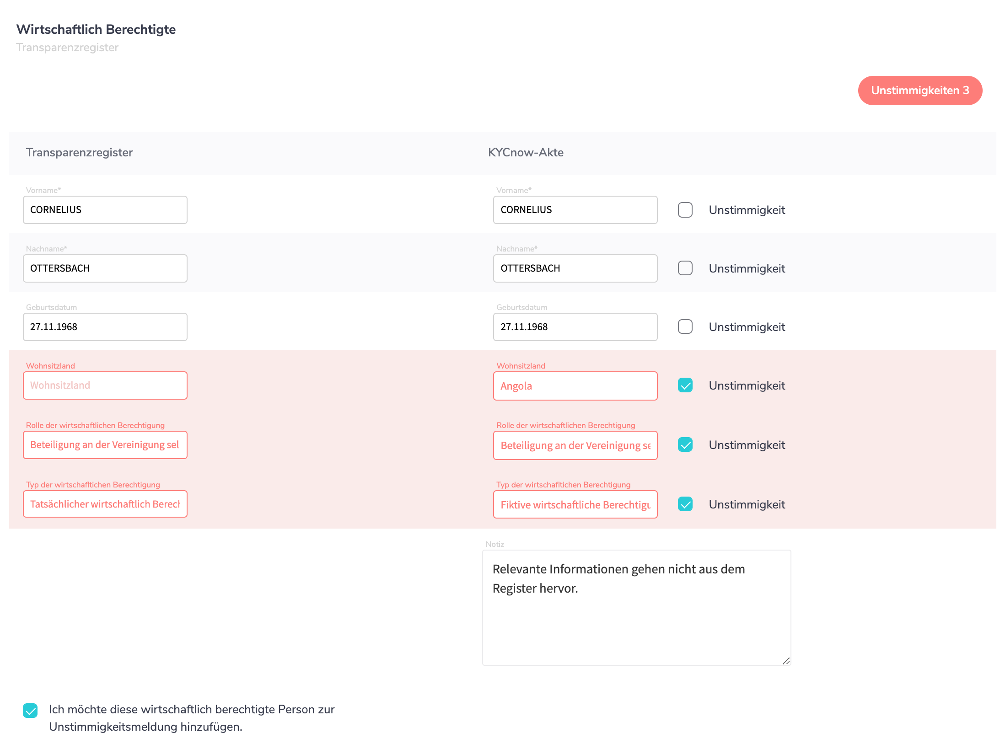

# Handbuch zum KYCnow-Modul „Transparenzregister“

Mit diesem Modul wollen wir Ihnen den Umgang mit dem Transparenzregister erleichtern und Sie darin unterstützen Compliance-Prozesse effizienter und effektiver zu gestalten. Im Folgenden beschreiben wir, wie Sie das Modul erfolgreich einrichten und beantworten Fragen zum Umgang mit dem Modul und wie dieses technisch funktioniert.  
Sollten Ihre Fragen mithilfe dieses Handbuchs nicht beantwortet werden, senden Sie uns einfach eine Mail an ([support@kycnow.de](mailto:support@kycnow.de)). Eine Frage, die uns oft erreicht, wollen wir vorweg beantworten:

## Welche Leistungen bieten Sie an?

Unsere Leistungen im Zusammenhang mit dem Transparenzregister lassen sich in drei Kategorien unterteilen: 

- Abruf von Daten
- Abgleich der Daten
- Unstimmigkeitsmeldungen

## Einrichten des Moduls

Um unser Modul erfolgreich nutzen zu können, müssen Sie zuvor folgende Schritte erledigt haben:

1. Account beim Bundesanzeiger anlegen.
2. Die Login-Daten für den Bundesanzeiger in unserer Anwendung unter „Einstellungen“ hinterlegen.

1. Die Zahlungsart, die Sie beim Transparenzregister hinterlegt haben, im Rahmen des Onboardings bei uns hinterlegen. Mit dieser müssen Sie außerdem mindestens 1x erfolgreich beim Transparenzregister bestellt haben.
    * Zahlen Sie per Lastschrift, bitten wir Sie anzukreuzen, die Kontodaten vorzubelegen.
    
2. Stellen Sie bitte sicher, dass vor jeder Bestellung mit Hilfe von KYCnow ihr Dokumentenkorb im Transparenzregister leer ist.

### Brauche ich einen eigenen Account beim Bundesanzeiger?

Ja, Sie müssen einen Account beim Bundesanzeiger anlegen. Über diesen Account wird mit dem Transparenzregister interagiert, also bspw. Abfragen getätigt oder Unstimmigkeitsmeldungen versendet.

Ihre Login-Daten werden dabei verschlüsselt hinterlegt, sodass diese nur von Ihnen geändert werden können. Die Login-Daten werden zu Beginn automatisch von uns validiert und können zu keinem Zeitpunkt eingesehen werden.

### Wer stellt die Rechnung?
Sie erhalten von uns monatlich eine Rechnung 
Separat erhalten Sie vom Bundesanzeiger, entsprechend Ihrer Abrufe, Rechnungen. Die jeweilige Gebühr, die vom Bundesanzeiger erhoben wird, können Sie der Transparenzregistergebührenverordnung (TrGebV) entnehmen oder [hier](https://www.transparenzregister.de/treg/de/hilfe?0) einsehen.

### Ist eine Sammelrechnung möglich?
Wir bieten Ihnen zukünftig die Möglichkeit, alle Abfragen des Tages zu sammeln und diese in einer „Warenkorbbestellung“ abzugeben. Dies hat zur Folge, dass Sie anstelle mehrerer Rechnungen am Tag nur eine Rechnung am Tag vom Bundesanzeiger bekommen. 

Technisch bedeutet die Warenkorbbestellung, dass wir abends alle Anfragen des Tages gebündelt an den Bundesanzeiger verschicken. 
Bei Einzelbestellungen wird die Abfrage sofort an den Bundesanzeiger geschickt.

Sie können sich zukünftig zu Beginn für eine der zwei Möglichkeiten entscheiden. Sollten Sie im Laufe der Nutzung auf die jeweils andere Möglichkeit umsteigen wollen, können Sie sich jederzeit an unseren Kundenservice ([support@kycnow.de](mailto:support@kycnow.de)) wenden. 
Eine monatliche Rechnungsstellung ist leider nicht möglich.

## Abruf von Daten
Unter dem Reiter „Dokumente“ können Sie einen Transparenzregister-Auszug bestellen. 

Danach erscheint ein Fenster, in dem Sie das Unternehmen, für das Sie den Auszug bestellen wollen, auswählen können. 
Alternativ können Sie auch auswählen, das Unternehmen nicht gefunden zu haben.
Dies führt zu einer [Unstimmigkeitsmeldung](#unstimmigkeitsmeldungen).

Um den Bestellvorgang abzuschließen, müssen Sie den Anfragegrund angeben. Dieses Feld ist zwingend auszufüllen.

Nutzen Sie einen Transparenzregister-Account, der nur das Auswählen einer Checkbox als Bestätigung des berechtigten Interesses im Transparenz-Register bedarf, müssen Sie an dieser Stelle lediglich ein Leerzeichen machen, um die Bestellung auszulösen.

Kontaktieren Sie support@kycnow.de, falls die Darlegung Ihres Anfragegrunds im Transparenzregister von einem Freitextfeld oder einer **einzelnen** Checkbox abweicht.

### Beziehen Sie die Daten direkt vom Bundesanzeiger?

Nein, wir stehen in keiner Partnerschaft mit dem Bundesanzeiger, sondern erhalten die Daten durch Abruf des Transparenzregisters.

### Brauche ich weiterhin ein berechtigtes Interesse?

Ja, ein berechtigtes Interesse ist verpflichtend.

### Wie schnell kommen die Daten wieder zurück?

Wir können keine konkrete Zeit angeben, da wir bei der Bearbeitung der Abfragen nicht involviert sind. Hat der Bundesanzeiger die Abfrage bearbeitet, bekommen Sie dies von uns sofort mitgeteilt. Die Verzögerung zwischen der Mitteilung des Bundesanzeigers und der Weiterleitung durch uns beträgt nur wenige Minuten. 

Die Bearbeitungsdauer durch den Bundesanzeiger beträgt wenige Stunden mitunter aber auch mehrere Tage.

---
**INFO**

Wir haben die Erfahrung gemacht, dass eine detailliertere Beschreibung des berechtigten Interesses eine schnellere Rückmeldung zur Folge hat.

---

### Erhalten wir die Daten auch strukturiert?

Ja, dazu lesen wir die Dokumente via OCR (optische Zeichenerkennung) aus.
Die Struktur ist wie folgt:
1. Vorname
2. Nachname
3. Geburtsdatum
4. Wohnsitzland
5. Staatsangehörigkeit
6. Wohnort
7. Umfang des wirtschaftlichen Interesses
8. Art des wirtschaftliches Interesses
9. Typ der wirtschaftlichen Berechtigung

### Erhalten wir die Daten auch als PDF?
Ja, Sie erhalten natürlich auch den durch uns ausgelesenen Transparenzregisterauszug.

### Was passiert, wenn die Transparenzregister-Auskunft leer ist?
Eine leere Transparenzregister-Auskunft ist nicht unüblich. Sie wird auch als Negativattest bezeichnet und bedeutet, dass dem Transparenzregister keine Angaben zu den wirtschaftlich Berechtigten gemacht wurden.

Dies kann bedeuten, dass von der Mitteilungsfiktion profitiert wird. Andererseits ist es auch möglich, dass noch keine Mitteilung getätigt wurde. In diesem Fall ist eine [Unstimmigkeitsmeldung](#unstimmigkeitsmeldungen) abzugeben.

Grundsätzlich empfehlen wir folgende Vorgehensweise:
1. Prüfen Sie, ob bereits in einem der anderen Register nach §20 II GwG die notwendigen Angaben zu den wirtschaftlichen Berechtigten stehen.
2. Sind in den anderen Registern keine Angaben gemacht worden, ist eine Unstimmigkeitsmeldung abzugeben.

## Abgleich der Daten
Nachdem die Abfrage durch den Bundesanzeiger bestätigt und der Transparenzregisterauszug durch KYCnow beschafft wurde, werden die ausgelesenen Daten im Reiter Transparenzregister tabellarisch in zwei Spalten dargestellt.

In der linken Spalte sind alle wirtschaftlich Berechtigten aus dem Transparenzregister sowie der Schufa GWG-Auskunft (und damit u.a. dem Handelsregister) aufgelistet. Die rechte Spalte listet alle wirtschaftlich Berechtigten aus dem KYCnow Reiter "Personen" auf. Das Tool versucht sogenannte Matches zu finden, indem es prüft, ob Name und Geburtstdatum von wirtschaftlich Berechtigten aus den Registern mit jenen aus KYCnow übereinstimmen. Daraus resultierend sind folgende potenzielle Unstimmigkeiten visuell sehr schnell erkennbar:

1. Ein wirtschaftlich Berechtigter ist lediglich in den Registern, aber nicht in den eigenen Daten vorhanden: Diese Person würde nur in der linken Spalte auffindbar sein.
2. Ein wirtschaftlich Berechtigter ist zwar in den eigenen Daten, aber nicht in den Registern zu finden: In diesem Fall würde die Person lediglich in der rechten Spalte aufgelistet sein.
3. Ein wirtschaftlich Berechtiger ist sowohl in den eigenen Daten, als auch den Registern vorhanden, aber die dazugehörigen Daten sind nicht identisch. Dies wäre beispielsweise der Fall, falls man Vergleichsdaten bei einem wirtschaftlich Berechtigten aus der Schufa GWG-Auskunft im Reiter Personen ändert. Dann würde eine Abweichung zwischen den originären Daten und den einem vorliegnden angezeigt werden.

Im Folgenden weitere Beispielszenarien.

Beispiel 1, Keine Unstimmigkeiten festgestellt:

Wenn wir Unstimmigkeiten bei einer wirtschaftlich berechtigten Person feststellen, markieren wir die Felder rot. 
Möchten Sie einen wirtschaftlich Berechtigten ihrer Unstimmigkeitsmeldung beifügen, müssen Sie dies unten links auswählen.

Beispiel 2, Unstimmigkeiten festgestellt

Sie können unter dem Reiter „Transparenzregister“ außerdem auch:

1. Angeben, dass sich weitere wirtschaftlich Berechtigte aus anderen Registern ergeben.
2. Eine weitere wirtschaftlich berechtigte Person Ihrer KYCnow-Akte beifügen. Wenn Sie darauf klicken, erscheint darüber eine neue Kartei für einen wirtschaftlich Berechtigten, in der Sie alle ermittelten Angaben händisch eintragen können.
3. Eine Unstimmigkeitsmeldung auslösen. Wenn Sie eine Unstimmigkeitsmeldung auslösen, werden sämtliche Unstimmigkeiten, die Sie erkannt und ausgewählt haben automatisch an das Transparenzregister übermittelt
4. Den Transparenzregisterauszug als PDF-Datei herunterladen.

### Wie wird die Mitteilungsfiktion abgebildet?
Macht das betrachtete Unternehmen von der Meldefiktion Gebrauch, äußert sich das in einem leeren Transparenzregisterauszug (Negativattest). Der wirtschaftlich Berechtigte muss in diesem Fall aus dem Handelsregister oder einem der anderen Register nach §20 II 1 GwG zu entnehmen sein.

Diese Information kann mithilfe der GWG-Auskunft bezogen werden, denn die GWG-Auskunft greift bei der Berechnung von wirtschaftlich Berechtigten auf die Daten aus dem Handelsregister zurück.
Haben Sie die GWG-Auskunft im Reiter "Personen" bestellt, teilen wir Ihnen sowohl die Mitteilungsfiktion als auch die entsprechende Quelle mit.

Es kann vorkommen, dass Ihnen eine Person doppelt angezeigt wird. Dies passiert, wenn ein Eintrag sowohl in das Transparenzregister als auch in eines der anderen möglichen Register erfolgt ist.

## Unstimmigkeitsmeldungen

### Wie stellen Sie eine Unstimmigkeit fest und melde sie?
Wir unterscheiden §23a I 4 GwG folgend zwischen drei verschiedenen Arten von Unstimmigkeiten:
**A) Die Rechtseinheit ist im Transparenzregister nicht aufzufinden.**
Diese Meldung kann direkt bei der Dokumentenbestellung initiiert werden:

Im Folgenden ist der erscheinende Dialog auszufüllen.

**B) Es konnten unter Einschluss der Registerlage keine wirtschaftlich Berechtigten ermittelt werden und das Transparenzregister lieferte ein Negativattest.**

Die Möglichkeit dieser Unstimmigkeitsmeldung wird im Reiter "Transparenzregister" im Falle eines Negativattests sowie keinen UBOs durch eine GWG-Auskunft zur Verfügung gestellt:

**C) Wirtschaftlich Berechtigte konnte ermittelt werden, aber diese oder einzelne Angaben weichen von den Registern ab. Hier kann es wieder zu den drei Szenarien kommen, die im Abschnitt "Abgleich der Daten" erläutert wurden.**

1. Ein wirtschaftlich Berechtigter ist lediglich in den Registern, aber nicht in den eigenen Daten vorhanden: 
Der wirtschaftlich Berechtigte ist nur auf der linken Seite zu finden. Sie müssen nun auf der rechten Seite, alle Informationen eingeben und in die untere Checkbox bestätigen. Nun erscheint der wirtschaftlich Berechtigte im Dialog bei dem Auslösen der Meldung:

2. Ein wirtschaftlich Berechtigter ist zwar in den eigenen Daten, aber nicht in den Registern zu finden:
Das Vorgehen ist identisch zu 1. bis auf den Fakt, dass der wirtschaftlich Berechtigte rechtsseitig vorzufinden ist. Wieder muss die Checkbox zum Hinzufügen selektiert werden. Weitere wirtschaftlich Berechtigte können auch mit Button "Wirtschaftlich Berechtigte Hinzufügen" hinzugefügt werden, um sie der Meldung anzuhängen (wenn diese noch nicht in der Akte vorhanden sind).

3. Ein wirtschaftlich Berechtiger ist sowohl in den eigenen Daten, als auch den Registern vorhanden, aber die dazugehörigen Daten sind nicht identisch:
Das Vorgehen ist identisch zu 1. und 2. bis auf den Fakt, dass der wirtschaftlich Berechtigte beiseitig vorzufinden ist. Wieder muss die Checkbox zum Hinzufügen selektiert werden.

Es ist zu unterstreichen, dass immer die wirtschaftlich Berechtigten der rechten Spalte der Meldung hinzugefügt wird. Eine ergänzende Modellierung der genauen Vorgehensweise können sie dem [Anhang](#anhang) entnehmen.

Die von uns ermittelte Unstimmigkeitsmeldung ist als Empfehlung zu verstehen. 

### Woher erhalte ich die Rückmeldung zu den Unstimmigkeitsmeldungen?
Unstimmigkeitsmeldungen werden vom Bundesanzeiger bearbeitet. Von diesen bekommen Sie auch Rückmeldung zu Unstimmigkeitsmeldungen, die Sie gesendet haben (üblicherweise per Mail an die Adresse des Transparenzregister-Accounts).

## Anhang
### Modellierung unserer Unstimmigkeitsprüfung
Der nachfolgende Prozess geschieht zu großen Teilen automatisch. Damit Sie aber nachvollziehen können, welche Schritte diesem Prozess zugrunde liegen, haben wir den gesamten Prozess moduliert.

In unserer Anwendung erfolgt die Suche nach der Rechtseinheit, für die ein Transparenzregisterauszug bestellt werden soll, in mehreren Teilschritten.

Zu Beginn haben Sie das in Frage stehende Unternehmen bereits gesucht und Ihrem Bestand beigefügt.
Eine genaue Beschreibung dieser Vorgehensweise können Sie unserem 
Schritt-für-Schritt-Guide entnehmen.

Zur Bestellung des Transparenzregisterauszugs (näheres dazu auf Seite 5) bieten wir Ihnen eine Liste möglicher Treffer an. Um Tippfehler etc. auszuschließen, kann die Liste auch ähnliche Treffer beinhalten.

---
**Fall A (vgl. Abbildung 9):**

Ist die Rechtseinheit beim Transparenzregister nicht zu finden, kann eine Unstimmigkeitsmeldung aufgegeben werden. 

---
Hierzu werden Sie nach der entsprechenden Auswahl darum gebeten, die Rechtsform der transparenzpflichtigen Rechtseinheit anzugeben. Dies dient dem korrekten Ausfüllen der Unstimmigkeitsmeldung.

Im Anschluss werden Ihnen nochmals alle Informationen des betroffenen Unternehmens aufgezeigt, mit der Möglichkeit, diese auch nochmal 
zu   

Wenn Sie das Unternehmen hingegen gefunden haben, erhalten Sie nach ein paar Tagen den Transparenzregisterauszug.
Je nach Inhalt des Dokuments können Sie die weitere Vorgehensweise auf Seite 14 (Szenario: Negativattest) oder auf Seite 15 (Szenario: Transparenzregisterauszug erhalten) nachvollziehen. 

### Szenario: Negativattest

Falls Sie vom Transparenzregister einen Negativattest erhalten haben, prüft unsere Anwendung im nächsten Schritt auf entsprechende Einträge im Handelsregister und, falls von Ihnen angegeben, auf von Ihnen ermittelte wirtschaftliche Berechtigte.

---
**Fall B**

Sollte trotz Abgleich keine Eintragung ermittelt worden sein, deutet dies darauf hin, dass zu Unrecht von der Meldefiktion Gebrauch gemacht wurde, was zu Unstimmigkeitsmeldung (B) führt.

---

Wurden hingegen Angaben zu wirtschaftlich Berechtigten ermittelt, werden diese im nächsten Schritt auf Vollständigkeit überprüft.

---
**Fall C**

Sind die Angaben unvollständig, ist wiederum eine Unstimmigkeitsmeldung an das Transparenzregister abzugeben.

---

Szenario: Transparenzregisterauszug erhalten

Wenn Sie einen Transparenzregisterauszug erhalten haben, fügen wir diesem zunächst, falls vorhanden, die von Ihnen ermittelten wirtschaftlichen Berechtigten hinzu. 

Im nächsten Schritt wird anhand von Vor- und Nachnamen sowie dem Geburtstag nach Treffern im Handelsregister gesucht. Die Suche erfolgt dabei nur nach Hardmatch.

---
**Fall D**

Sollten bei dem ersten Abgleich Unterschiede festgestellt werden, kann dies als Unstimmigkeitsmeldung an das Transparenzregister geschickt werden. 

---

Wenn im ersten Abgleich keine Verschiedenheiten erkannt wurden, werden im nächsten Schritt alle übrigen Informationen abgeglichen. 

---
**Fall E**

Kommt es hier zu Unstimmigkeiten, können Sie diese wiederum an das Transparenzregister melden.

---

Im letzten Schritt, falls auch die übrigen Informationen keine Unterschiede aufweisen, wird auf Vollständigkeit der Angaben geprüft. 

---
**Fall F**

Sind die Angaben nicht vollständig, können Sie dies ebenfalls an das Transparenzregister melden.

---
